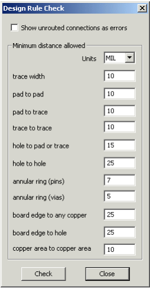
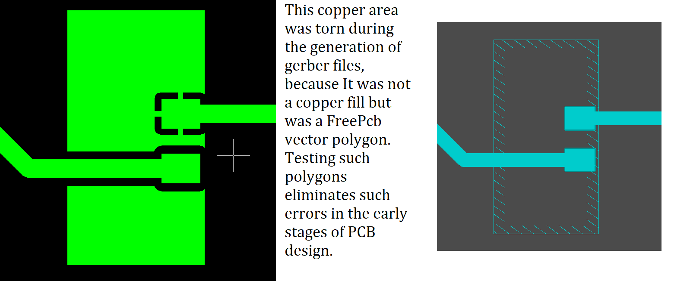

## How to check pcb design?

FreePCB has a Design Rule Checker that checks your project for compliance with a set of design rules. Selecting Tools > Design Rule Check pops up the following dialog:

 

parameter                   | description
----------------------------|------------------------------------
trace width                	| The minimum trace width allowed
pad to pad                 	| The minimum distance from the edge of one pad to another on a different net (a warning is displayed if the distance is less on same net)
pad to trace               	| The minimum distance from the edge of a pad to a trace on a different net
trace to trace             	| The minimum distance from the edge of a trace to a trace on a different net (this is the initial clearance value of the SET_CLEARANCE function)
hole to pad or trace       	| The minimum distance from the edge of a hole to a pad or trace on a different net (a warning is displayed if the distance is less on same net)
hole to hole               	| The minimum distance from the edge of a hole to the edge of another hole
annular ring (pins)        	| The minimum width of copper surrounding a hole for a pin
annular ring (vias)   	     | The minimum width of copper surrounding a hole for a via
board edge to any copper   	| The minimum clearance between any copper feature and the edge of the board
board edge to hole         	| The minimum clearance between the edge of a hole and the edge of the board
copper area to copper area 	| The minimum clearance between copper areas, and also between a copper pour (full hatch pattern) and another object on a different net

When you set all the clearance in the dialog box, click the Check button, a log window will appear with a list of errors if any. Also, circles will appear on the circuit board in the places of errors. To make the circles more visible and you find them on the circuit board, press and hold the "D" button. If you want to quickly test again, press CTRL + D.

It is also recommended to do a check of copper areas, which includes:

* 1 Removing the vertices of colinear segments
* 2 The union of similar intersecting copper areas (if the thickness of the side is the same, and the hatching pattern for both contours)
* 3 Tearing Test for copper areas without filling (for such copper areas clearance on different nets appears automatically when creating gerber files)

