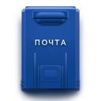

## Schematic Constructor v1.0 (circuit design software)

***
Program features:

* Support for multi-page schematic design

* Support for multi-graphic part symbols

* Export PADS-PCB netlist (supported by OrCad KiCad DipTrace Altium Eagle EasyEda, etc.)

* No component libraries required

* Ability to move part pins directly in the main schematic editor window.

* Importing a bitmap.

* Continuous numbering of parts

* Search for a part by attribute and import from adjacent projects

* Synchronizing attributes between pages

* DRC check

***
## Philosophy

The multi-page editor is designed to be able to quickly create small electronic circuits without any libraries. Using a simple tool - polylines, you can draw a schematic diagram and create a netlist.

With `Schematic Constructor`, you no longer need to create graphic symbol libraries. The program is designed in such a way that there is no graphic symbol editor. This has some advantages, for example you can rename and move part pins right in the workspace. The graphic symbol for the same part may differ from project to project. If in one project you use microcontroller pins, in another you do not use them, but use completely different pins, then there is no need to save a graphic element to the library for each circuit. When you create a project for the first time, you draw the details of that project. Then, when creating a second project, you can import parts from previous schematic projects created earlier in the `Schematic Constructor` into it. The program will search for a part by name or another attribute that you specify in the dialog box, and after finding this component will insert it into your current project. This way you don't have to go through the projects to find a part, but you should keep the project folders in one shared folder. You can also insert a page from another project (the menu `Edit->Paste page from file`) to take a piece of the circuit diagram from there.

Special attention should be paid to the topic of hidden text in the schematic design. You should avoid hidden texts in the project, because they are not displayed when printing the diagram on paper, therefore it can lead to errors. Initially, the idea was to make it impossible to hide text attributes, such as the name of the footprint, or the name of the pin, but when using the editor in practice, this turned out to be a serious limitation, and this idea had to be abandoned. But on the other hand, an option was added to search for hidden footprint attributes to control them.

***
## Multi-graphic part symbols

In the `Schematic Constructor`, you can create multi-graphic part symbols. Just draw two graphic symbols, name the first one for example `DA1.1`, and the second one `DA1.2`. The program will treat it as one part DA1, and it will also appear in the BOM list as `DA1`. Either period or dash can be used as separator.

[`I want to see how the parts might look in Schematic Constructor 1.1`](look_parts.md)

***
## Renumbering of parts

You can automatically renumber parts on a page, either from left to right or from top to bottom. You can also combine two options - number part of the diagram from left to right, and the other part from top to bottom if, for example, you have different blocks of the diagram on the same page. A part reference designator is a unique ID by which a part can be found on a page, so in `Schematic Constructor`, two parts with the same reference designator cannot be placed on the same page. For this reason, it is recommended that you clean up the reference designators before renumbering parts. There is a special menu item for this called Clear Part Numbers. After cleaning, the part numbers will start from `50000`. Then you can already number them in order from number `1`. During renumbering, the program will also check the designations of parts on other pages that are included in the netlist, so do not forget to clear the part indices of these pages (which included in the netlist).

***
## Connection to Freepcb

`Schematic Constructor` and `Freepcb-2` are self-contained software, they can be used separately from each other. By drawn a diagram in `Schematic Constructor`, you can design a PCB in another environment that supports PADS-PCB netlist import. But if you choose FreePcb-2, then you have the advantages of being reminded when you make changes to the circuit, so you don't forget to import those changes to the PCB (as well as other benefits). Communication between the schematic editor and the PCB editor is done by exporting a netlist from the `Schematic Constructor`, and importing a netlist into Freepcb-2. The electrical diagram is the original source, so if after importing the netlist you want to modify the project (add / remove parts on the PCB), then you must start from the schematic diagram. This may seem like a kind of limitation, but this method of editing is classic and helps to avoid mistakes, unlike the option when you first make changes to the printed circuit board, and then to the circuit.

***
## Ref-lists

Quite often, we design a universal PCB for multiple devices or multiple modifications of the same device. We create a generic circuit diagram, generate a netlist and route the PCB. In fact, we have a circuit board diagram and not a diagram of the device itself. Therefore, we must be able to select from the general scheme a list of those parts that are not used in a particular device modification, and then remove them from the BOM list. To do this, the `Schematic Constructor` provides the ability to create up to 20 ref-lists, in which you can place any number of part designations that should not be installed on the board, or vice versa, must be installed on the board. In this sense, do it as it is more convenient for you (just to make the list shorter). Then, when generating a BOM file, you simply select the desired ref list in the dialog box, and the direct / inverse mask of the selected ref list will be superimposed on the full list of parts

***
## For whom

`Schematic Constructor` is ideal for small projects. At the moment, the editor supports 8 pages, which can be linked (related numbering of parts) or stand-alone (when duplication of RefDes between pages is allowed). You can then export these pages to a PDF file. The orientation of the pages in the PDF file is automatically selected according to the layout orientation (Typically, the layout along the Y axis is less than the X axis - this is landscape orientation). The number of pages may be expanded in the future (on request).

The program is equipped with an automatic check of design rules before creating a netlist. Checking the design for errors is divided into 2 stages. First, the nets are checked for contact and other errors during the generation of nets, and then the names of parts and pins are checked using the DRC dialog box, in which there is also control of the clearance of texts on the polyline. The output is a netlist, BOM file and parts list.

***
## Support department:

If you have a question or suggestion related to `Schematic Constructor`, do not forget to write to duxah@yahoo.com

***
## License

`Schematic Constructor` is distributed under the `FreeWare license`. (free for individuals and organizations)

***
## [Donate to development](https://paypal.me/freepcb2)

You can donate to the `freepcb.dev` resource fund. If you are using FreePcb-2 not in commercial interests, then you can just do something useful, for example, place a link on your site, or make a video instruction for the programs. This is all considered a donation. Your donations are needed to support `freepcb.dev`.

***

## [Learn from video](How_to_cd.md)

## [I want to try this software right now](Download.md)

`Software copyright Duxah (c) 2020`
