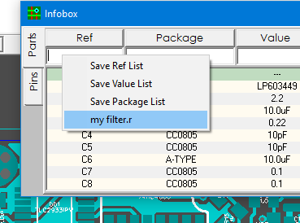

## Ref list

You can save the current list of parts in Infobox so that you can restore it later. To save the list, right-click on the RefDes editbox and select the menu item "Save Ref List". 

Next, enter the name in the same window and press ENTER. The list will be stored as a file. To restore the saved list, right-click on the RefDes editbox again and select this file.

_Good to know! You can add a new list to the existing list (merge lists). To do this, simply when saving a new list, give it the name of an existing list to merge with it._
