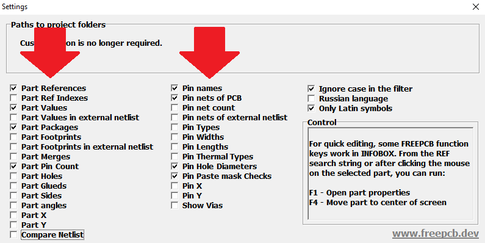
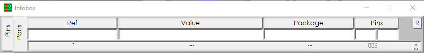
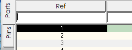
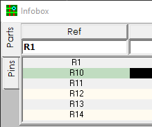
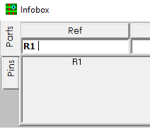
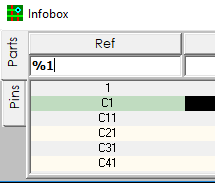
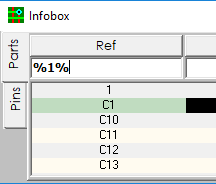
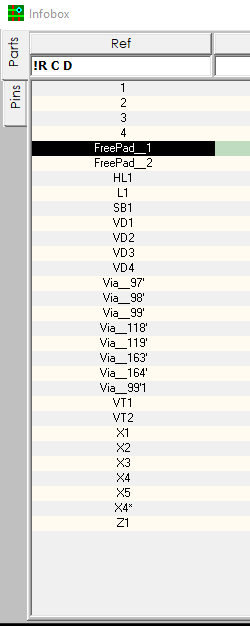

Select the necessary columns in the InfoBox settings window, for example, like this:

Now close the settings window and the selected columns will appear in the main program window.

To swell size of the window, pull on the window corner. (To quickly reduce the size, press ESCAPE)

Set focus to a filter string, such as REF.

If you simply type `R1`, then in addition to `R1, R10, R11`, etc., may appear in the list (if they are present in the project).

If you want only `R1` to remain in the list, add a space at the end.

You can also enter a few notations with a space.

If you type `%1` you will get in the list all references that end with line `1`

If you type `%1%`, you will get in the list all the symbols that contain the character `1`

The exclamation mark at the beginning of the line means "exclude". For example, if you write `!R`, then all symbols starting with `R` disappear from the list. To filter even more, you can add letters to this line and put a space between them (at the end you also need to add a space).

to be continued...

# [return](How_to.md)
