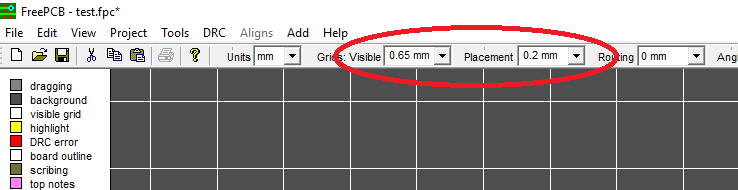
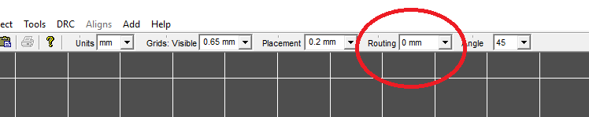
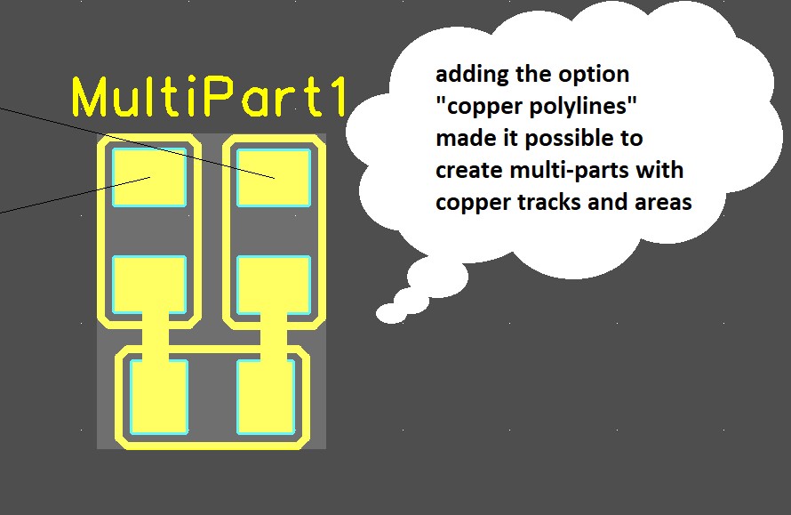

***
# Introduction:
* 1 to 16 copper layers
* Board size up to 60 inches by 60 inches
* Uses English or metric units (i.e. mils or mm) for most functions.
* Footprint Wizard and Footprint Editor for creating or modifying footprints
* Import and automatic export of PADS-PCB lists
* Import and export to mechanical format DXF
* Import and export Pcad ASCII files
* Exports extended Gerber files (RS274X) and Excellon drill files
* Design rule checker
* Autosave

View

***
# About
The FreePcb-2.000 or later program presented on this site is a development branch of version [1.359](http://freepcb.com), published in 2010. FreePcb-2 contains new features not available in version 1.359 and provides more freedom for circuit board developers. Start working with FreePcb-2 right now to feel the difference.

***
# The program is focused on:
1. accessibility (it does not have a limit on the number of pins, footprint libraries or any other parameters, it has only limitations on 10,000 parts contained in the project file, but this is more than enough for most developments),
2. ease of learning (creating a manual for version 2-030),
3. reduction of time for the development of printed circuit boards (A distinctive feature of FreePcb and FreePcb-2 from other PCB-editors is an interface using function keys, which speeds up the process of editing a printed circuit board for an experienced user),
4. saving computer memory (takes ~ 50MB hard drive),
but at the same time includes almost all the tools needed for professional use (suitable for small businesses). 

***
# Latest improvements and new features

`Version 2-030 (2019-08-30):`

* Editable grid. You can change the step of the visible grid or placement grid directly from the main program window.

* Meshless tracing mode. (more convenient mode, because additional vertices are not created when starting the trace from the pad when the pad is not on the grid nodes).

* In the footprint editor, a polyline can be transferred to a copper layer. Thus it is easier to draw for example PCB antennas and other complex footprints.

* ...

 The [download](https://github.com/Duxah/FreePCB-2/archive/master.zip) (portable version from 08/30/2019) includes a folder with the program, manual 1.359, footprint libraries, examples of printed circuit boards, a description of the 2.028 file format for developers.

 If you like version 2-030, place a `freepcb.dev` link on your site. Have fun using FreePcb-2

_You can participate in the improvement of the application. Feel free to write a message regarding working with FREEPCB so that we can release the official version 2-030 as soon as possible. Working together is always more efficient._

***
### Companies that use FreePCB-2:

### Partners:

***
### Contacts.

* [User forum](https://groups.yahoo.com/neo/groups/FreePCB/info) on Yahoo Group. 
* If you have any suggestions related to FreePcb-2 or you do not want to submit your question for public review, send to [email](https://freepcb.online/Discuss/).
* If you want to improve the translation of this document, please send your file by email from the site [freepcb.online](https://freepcb.online/Discuss/)

***
### `useful links`
1. [License](LICENSE)
2. [FreePcb user guide 1-359](https://github.com/Duxah/FreePCB-2/raw/master/FreePcb-2/bin/doc/freepcb_user_guide.pdf)
3. [FreePcb-2 "How to.." guide](/How_to.md)(is underway)
4. [About this development branch](/About_development.md)

***
# Get started with FreePcb-2
Download the folder with the application and run the file FreePcb.exe

### Training on the example of the smart_kitchen.fpc file in the EXAMPLES folder
In this example, 3 independent circuit boards. (printed circuit board panel). In the context menu of the right mouse button, click the full view to see them entirely. From the Tools main menu, launch the Infobox application, which will help you find the pcb part in the project. 

[Start learning FreePcb-2](/How_to.md)

`(Translated from Russian by Google inc.)` ©2019
