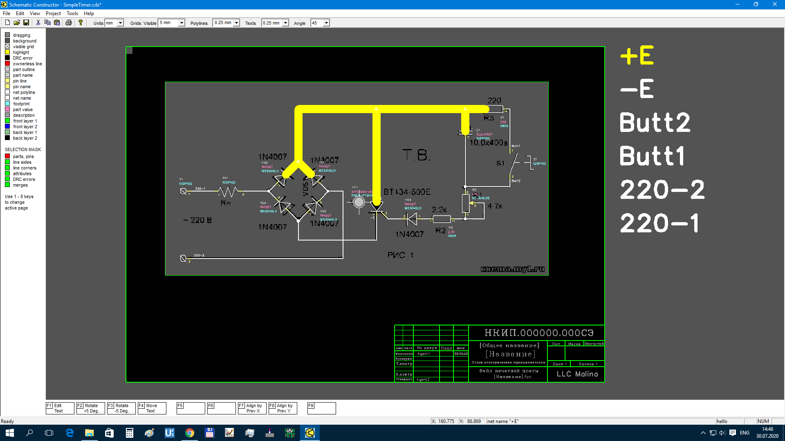
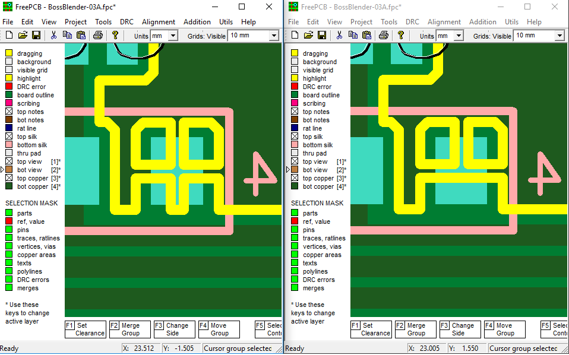
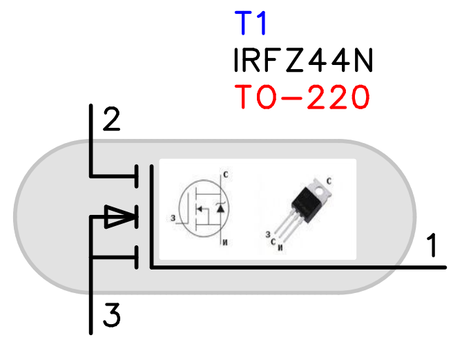

<link rel="shortcut icon" type="image/png" href="https://github.com/Duxah/FreePCB-2/blob/master/pictures/favicon.png?raw=true">

***

_This document has been translated into English from another language (the author is not responsible for the inaccuracy of the translation, if any)_

***

_In connection with the recent events in the International political arena, the possibility of supporting freepcb.dev in my face runs into insurmountable obstacles. If you are willing to help now with renewing this domain name (freepcb.dev) please email me as soon as possible. If you are ready to help assist me in moving to your country, please contact me by e-mail freepcb.development@gmail.com_

***

### `Introduction`

* 1 to 16 copper layers
* Board size up to 60 inches by 60 inches
* Uses English or metric units (i.e. mils or mm) for most functions
* Schematic editor included
* Footprint Wizard and Footprint Editor for creating or modifying footprints
* Import and automatic export of PADS-PCB lists when saving file
* Import and export to mechanical format DXF
* Import and export Pcad ASCII files (is maintained by Altium)
* Exports extended Gerber files (RS274X) and Excellon drill files
* Design rule checker
* Autosave (all software versions have autosave of the current file to the root folder \ AUTOSAVE with a frequency of 1.5 minutes)

***

### `Window view`

***
### `About FreePCB-2`

FreePcb is a unique PCB design program with a function key interface. Version 2.0 presented on this site is a fork of version [1.359](http://freepcb.com), taken for revision in 2014. FreePcb-2 contains new features not available in version 1.359 and provides more freedom for circuit board developers. If you don’t want to waste your time mastering complex PCB design applications, download FreePcb-2, which can do a lot of what CADs can do, but is easy to learn and takes up little disk space on your computer. FreePcb-2 does not have a huge number of buttons as in other CAD systems, the purpose of which is not immediately clear. There are only 9 buttons (F1 ... F9), the Functions of which change depending on the type of the selected element (part, vertex of trace, segment and etc.), so FreePcb-2 can be studied even without instructions. There is also a right-click context menu with additional features. 

***
### [`Schematic Constructor`](https://freepcb.dev/ECDS.html)

In FreePcb, you can create a netlist manually by adding parts and then connecting their pins. But you can also import a netlist in the PADS-PCB popular format from FreePCB2 compatible Schematic Editor. See description on [this page](https://freepcb.dev/ECDS.html)

***
### `Uploading Gerber files`

If at least one of the following programs is installed on your computer:

* **ViewMate** 

* **GerberLogix** 

 

* **Gerbv (GEDA's Gerber Viewer)**

You will be able to upload gerber files into it for viewing, using the menu command directly from the FreePcb-2 window. (available from November 26, 2019)

Put a shortcut to the viewer in the "Shortcut" folder, which is provided in the root directory of Freepcb2, and then this item will appear in the main File menu.

***
### `Advantages`
1. accessibility (it does not have a limit on the number of pins, footprint libraries or any other parameters),
2. ease of learning (see useful links),
3. reduction of time for the development of printed circuit boards (A distinctive feature of FreePcb and FreePcb-2 from other PCB-editors is an interface using function keys, which speeds up the process of editing a printed circuit board for an experienced user),
4. saving computer memory (takes ~ 50MB hard drive),
but at the same time includes almost all the tools needed for professional use. 

***
### `Latest improvements`

`FreePcb-2.4:`

* Improved copper fill in places of thermal barriers

* Disabling the copper area selection mask (in the left pane of the screen) now makes the copper fill hatching invisible. Thus, the hatching of copper fills no longer interferes with viewing the PCB through all layers.

`Schematic Constructor-1.4:`

* Improved file dialog

* The PDF file supports links to websites when you select the File->Print to PDF menu. You can create a link to the site using the polyline attributes setting dialog box: On the selected polyline, press the F1(Set attributes) function key. And then click the appropriate button on the add Command template tab.

* When creating a new project page, it can be inserted anywhere, that is, for example, between other pages. When you press the menu button view->add new page, a window pops up with a question for clarification. (Procedure: First go to the page where you would like to insert a new page, and then click the view menu -> add new page)

* The "Scale Factor" function changes only the coordinates of objects without changing the thickness of the polyline and the size of the text

* You can paste a schematic snippet from another open freecds window, using the keyboard shortcut Control+C then in another window Control+V

* The program controls prefixes in parts designation when, for example, in one scheme you designated part 0E@0805 with the RS prefix and in another scheme you mistakenly designated it with the RP prefix (the same component 0E@0805 ). In this case, the program will display a message so that you can correct this error. (Explanation: 0E@0805 means this part has VALUE=0E and FOOTPRINT=0805)

* In the parts import dialog box, the description of the part is displayed, which the program reads from a text file attached to this part. Attach a text file to the part using the right-click menu: to do this, right-click on the selected part in the workspace and select the COMPONENT ATTACHMENTS menu and then select the submenu: attach file, txt format. In the first line of the text file, enter the basic information that the program will then always display in the part import dialog, save the file

* In the part import dialog, the list is now sorted by prefix, which is much more convenient than by the "value" parameter as it was before.

* The "Footprint Library Manager" program reads the fpc library of PCB files to view the used footprints. Just instead of specifying the path to the footprint library, specify the path to the PCB project folder. (Earlier, the program could only read library files with an fpl extension.)

* You can attach a picture to any part in the schematic editor via the "Import Part" dialog box, F1 button.

* You can attach all datasheets to the component, as well as a picture of the part's package, and even a URL link to the store where this part is sold. To do this, call the right-click menu on the selected part and click COMPONENT ATTACHMENTS

* Extended bom-file generation. The extended bom-file is created in PDF format. All parts are grouped by reference designations. In order for the program (instead of question marks) to correctly create headers Fill in the file prefixes.txt, which is located in the Root directory of the program.

***

 

### [Download](Download.md)
### 

 If you like, post [this](pictures/logo.png) picture on your website. Have fun using FreePcb-2.

You can participate in the improvement of the application. Feel free to write a message regarding working with FREEPCB2 so that we can release the official version FreePcb2.4 & Schematic Constructor 1.4 as soon as possible. Working together is always more efficient.

***
### `Partners`

 )
 )
 )
 )
 )
 )
 

_[to learn more...](partners.md)_

***
### `Contacts`

* You can use the [forum of the first official version of FreePcb](https://groups.io/g/freepcb), which has been moved to groups.io since 2020, or write to the developer of this software fork - share your idea or report a bug to duxah@yahoo.com
* If you have your own libraries of footprints that you are ready to share with everyone, please send your file by email

***
### `Useful links`

1. [License](LICENSE)
2. [FreePcb user guide 1-359](https://freepcb.dev/FreePcb-2/bin/doc/freepcb_user_guide.pdf)
3. [FreePcb-2 "How to.." guide 2020](/How_to.md)
4. [How to make a schematic design](/How_to_cd.md)
5. [NEW! Translating the schematic editor's manual into English and Spanish](Translated.md)
6. [About this development fork](/About_development.md)
7. [For software developers](developers.md)
8. [Actual tasks](tasks.md)

***
### [`Get started with FreePcb-2`](/How_to.md)

*The text of this site is a translation from foreign language using Google inc. ©2019-2022
If you want to improve the translation of this content, please send your file by email*
