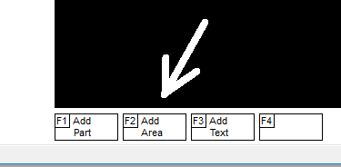
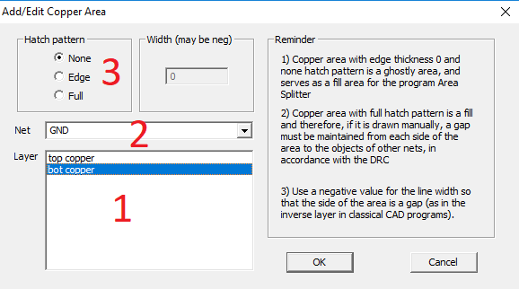

# How to add copper area

Press the F2 button, and then in the dialog that opens, select:
1) Copper area layer
2) Network
3) Fill style

Click OK to start dragging. To complete, right-click. You should know that the clearance for objects of different networks will be created automatically when the generation of the Gerber file of the layer occurs, provided that it is selected:

* EDGE style fill area

or

* NONE region fill style with non-zero side width

A copper polygon with a NONE fill style and zero width of the side does not interact with other objects at all and does not participate in the creation of a gerber file. It is only needed to create a POUR area.

# [return](How_to.md)

[How to pour area](pour_area.md)
