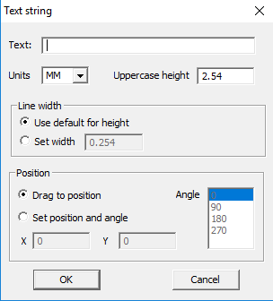

### How to add text (footprint)

You can place text on the `COPPER` layer, `SILK` layer, or `NOTES` layer. To create text, use the `F2_ADD_TEXT` key. Everything is simple here, you need to set the height of the text and the width of the line, well, enter a text line in the upper field. The process of creating text is the same as in the previous version `(FreePCB 1-359)`, but in the current version it is possible to change the layer. To change the layer you need to select the text and select the layer with the `F5` `F6` or `F7` keys. If you want to place it on the opposite side, select it not with a click, but with a selection frame. (with the selection frame with the mouse) and reflect the [group](fp_group_edit.md) with the F6 key.

