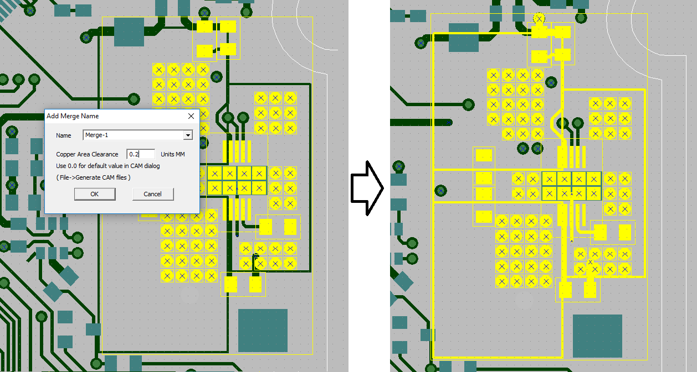
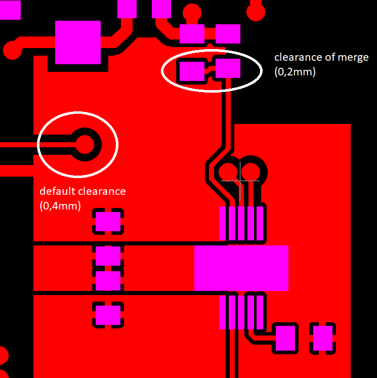
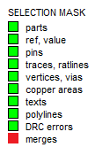

## How to merge objects

In FREEPCB-2, you can combine several parts into a merge. Connections as well as copper areas will be automatically selected and added if they are inside this group. Any other objects except connections can be added to the MERGE group:
 
- polyline,
- text,
- a copper area not connected to this group,
- cutout in a mask,
- board outline.

To create a MERGE object, select the parts and those objects that you want to include in this group and press F2_Create_Merge.

In the dialog box, you need to enter a name and set the clearance for polygons with hatching EDGE or NONE. What does it mean? For polygons with EDGE or NONE hatching, clearance on different nets is generated when creating gerber files, and therefore is not currently displayed on the screen. This clearance is set in the gerber export settings dialog box (call Ctrl + G), but it will be individual for each MERGE object.

In the following example, a merge is created where inverse polygons with NONE hatching and a side width of 0.2 mm are used, and therefore an individual clearance is also set to 0.2 mm.

Now we will generate the top_copper gerber file and look through the ViewMate viewer:

To select a merge, left-click on the part that belongs to this merge. 
To disable the merge selection, left-click on the MERGE flag in the selection mask (left).

Starting with version 2-033, FreePcb-2 supports one Merge attachment. That is, a merger can be inside another merge. For example, to align a group of parts, you can create a merge, then align this merge, then destroy this merge. See the next paragraph.

