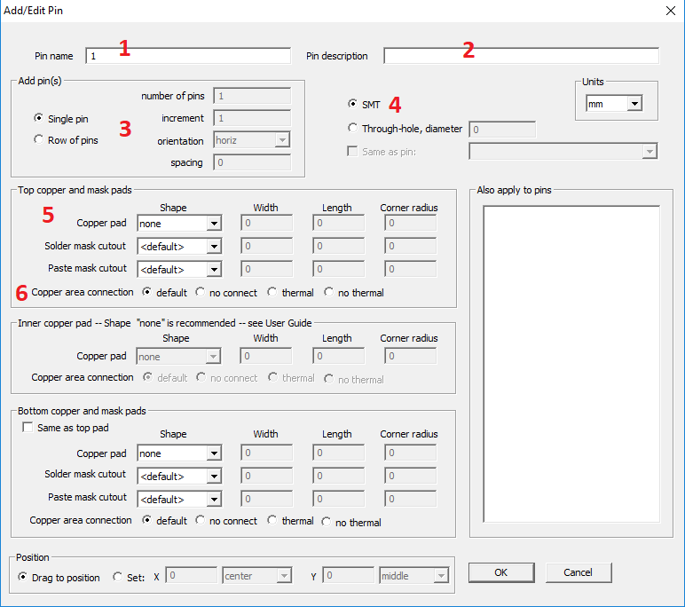

## How to add a new pin?

Select the Add > Pin menu item. This pops up the Add/Edit Pin dialog. The controls in this dialog are pretty much self-explanatory. Some of them will be enabled or disabled depending on the pin being added. Since we are adding the first pin, the Padstack > Same as pin # check box is disabled because there are no other pins present. 

We describe the main fields:

1) Pin name - a unique identifier for the pin (for example, 1, 2, a, b, A1, B2 ....)
2) Pin description - Use if you create a unique footprint for some part, for example, for the microcontroller you can write the name of the ports. It is displayed on the PCB when you hover over the pin.
3) You can create a series of pins.
4) Pad type: SMD or pass-through.
4) The choice of the shape of the pad. If you create a smd pad in the top layer, then in the bottom you must select the NONE form.
5) Type of connection to the copper area. You can set individually for any pin.

[return](How_to.md)
