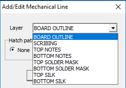
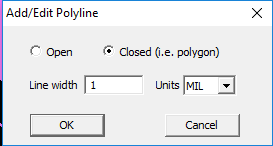
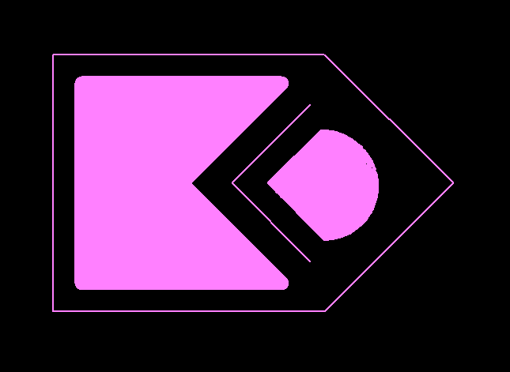

# Mechanic Polylines

Click the menu item `MECHANIC LINES` in the main menu `ADD`.

Using the dialog box that appears, you can add to the PCB project:

- lines of graphics on a silk-screen or a notes layer.
- cutouts in a solder mask (line or area)
- board outlines
- V-cutouts

After selecting the layer, you can immediately select the fill style of the polyline. If you want to draw a filled area, check `FULL`.
Next, another dialog box will appear in which you need to select a opened or closed line. If you want to draw a filled area, check the `CLOSED` checkbox. And finally, you need to enter the line thickness without forgetting the units of measurement on the right.

Start drawing a line. When you want to finish drawing, right-click to stop dragging.

Example:

To repeat drawing a line with the same parameters and in the same layer as the previous drawn line, press `F4_REPEAT_LINE` in the None Selection mode.

# [Return](How_to.md)
