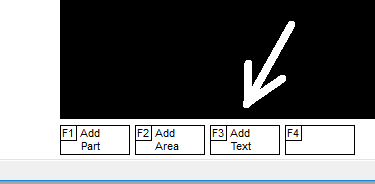
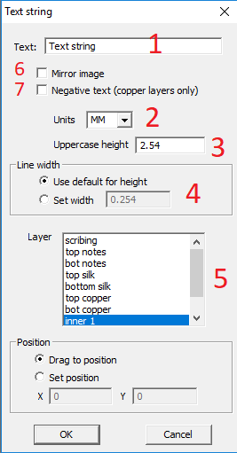

# How to add text?

Click on `F3_Add_Text`.
In the text options dialog box:

1) enter a text string
2) select units
3) enter the height of the text
4) enter the line width of the text
5) select a text layer

If you selected the `BOTTOM` side, check the box `MIRROR` (6).

If you placed text inside a copper area with the hatch style of `EDGE` or `NONE`, you can use the `NEGATIVE_TEXT` option (7) to draw the text as a hole in the polygon.

_It is useful to know that when a text string matches the name of a network, that network will be half-highlighted._

