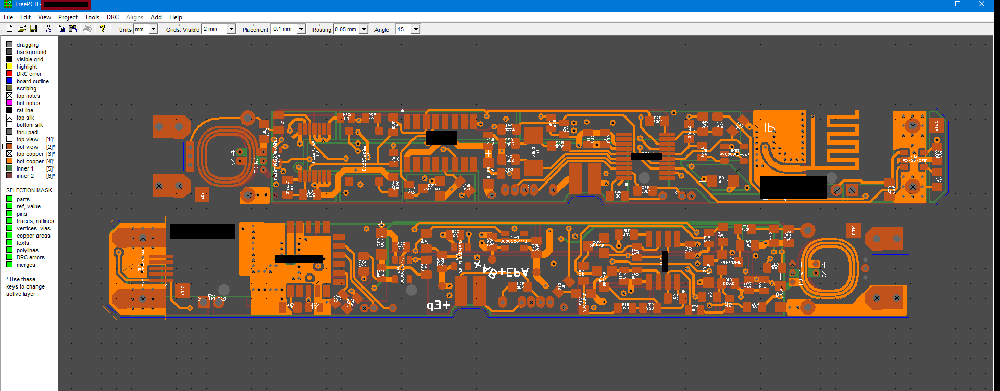
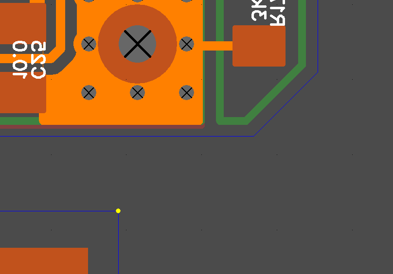
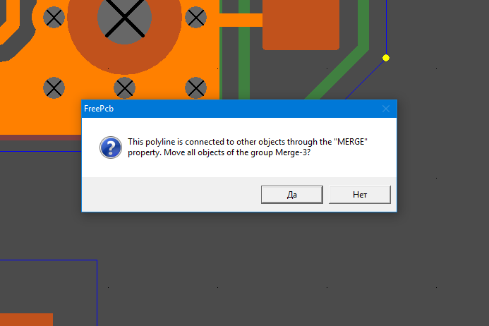
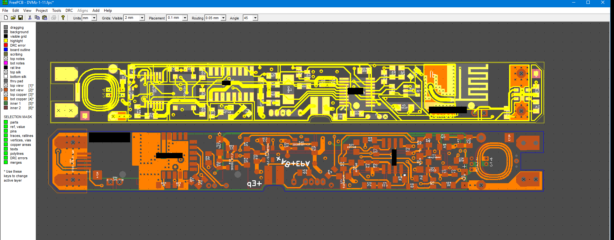

### How to align group

When a group of objects belongs to a merge, then aligning this group along one of the vertices of the lines or along the pad will not be difficult. In this example, the printed circuit board on top is merged completely into a merge and we can align it to the right edge of the lower board.

`screenshot 1`
 

Click on the vertex on which you want to align so that the program remembers its coordinates. 

`screenshot 2`
 

Then click on the vertex you want to shift, and press the function button F7 Align by prev X

`screenshot 3`

 

`screenshot 4`
 

You can also align this board with the coordinates. 

1) Need set the origin to the vertex (in the `screenshot 2`): first select this vertex and then click in the main menu `Tools-> Set Origin into selected item`. Zero coordinate is set. 

2) Then select the vertex (in the `screenshot 3`) and press` F1 Set Position`. Set new coordinates, for example `x = 0` `y = 2` (mm). This function is convenient to use when you need to create clearance between boards (as in our example). The clearance is 2mm.

[return](How_to.md)
