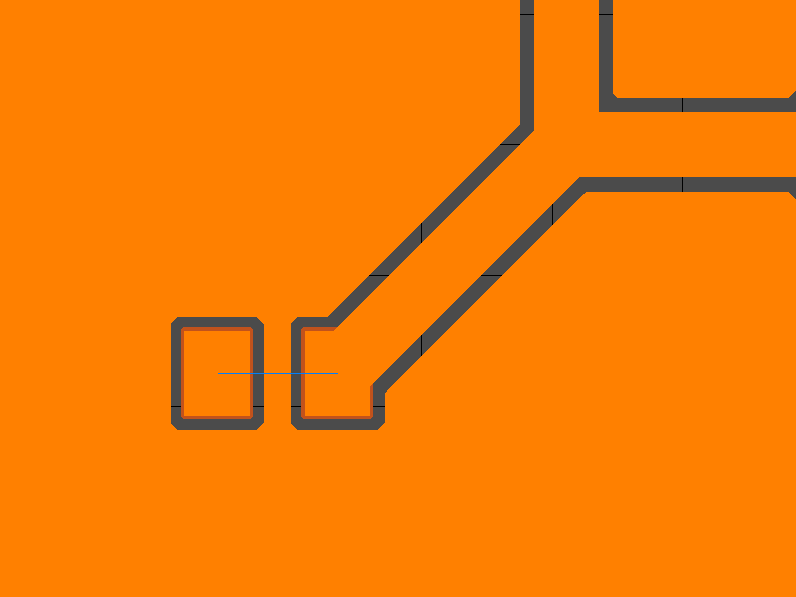
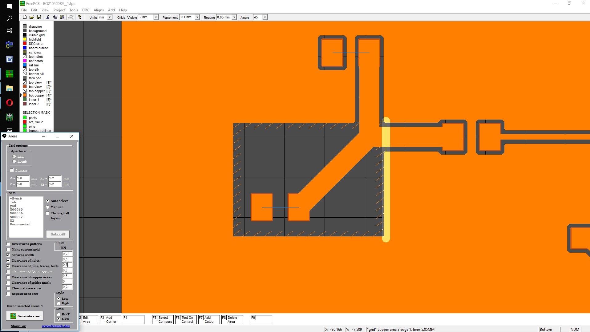
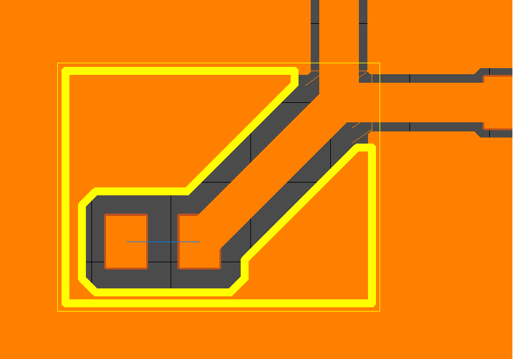
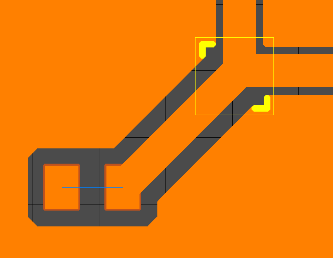
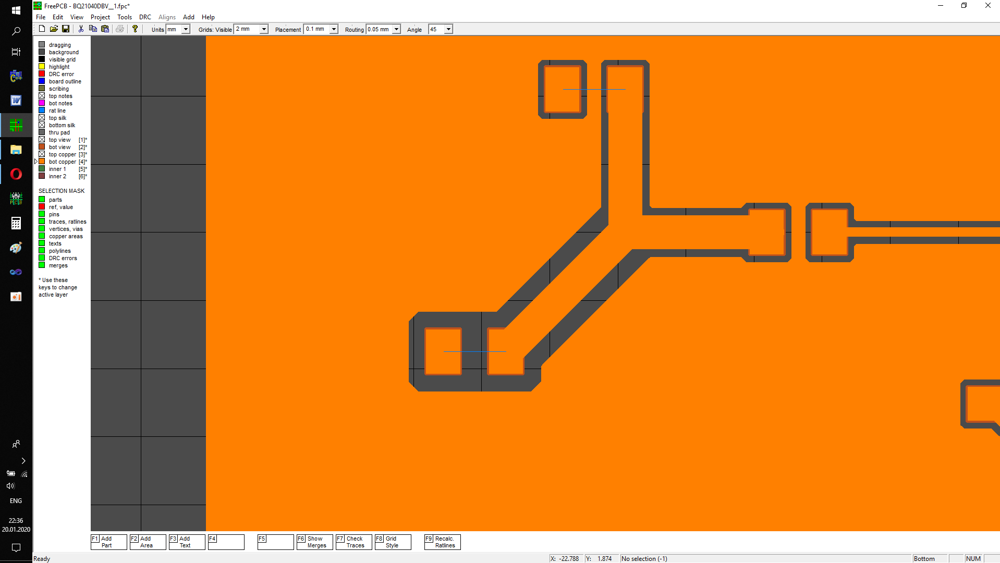

### How to add area cutout

When the side of the copper area is highlighted, press the `F7 Add Cutout` softkey.

Sometimes it makes sense to refill a piece of the copper area instead of completely refilling it. This is necessary, for example, when you have a fill that you manually adjusted, and there is no need to completely re-fill. In order to re-fill a piece of the copper area, in addition to the cutout to the same place, you need to add a new area for further pouring. While drawing a cutout in the drag mode of the first vertex, press the `F7 Area Repour` function button. 

At the end of the drag, fill the formed copper area. 

And then merge the fill by clicking on the main menu DRC-> Check Copper Areas

And these ugly corners will be deleted using the function `F9 Delete Bridge`

It turned out a piece of copper area with a different clearance

