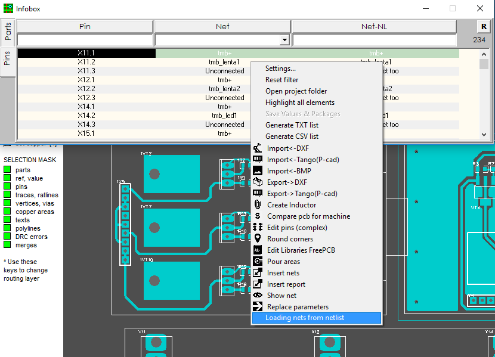
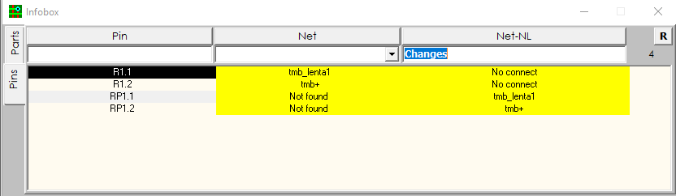

## `Comparing netlists`

When the netlist of the previous version of the printed circuit board is already loaded in the Infobox, you can compare the lists of pins and the lists of pin networks. Make Net and Net-NL columns visible in Info Box settings.

Go to the PINS tab and select the right-click menu Download nets from netlist. The contents of the external netlist will be loaded into the Net-NL column and you can make a comparison with the Net-PCB column. For convenience, the lines that differ in these columns become highlighted in yellow. When netlists are absolutely identical, there will be no yellow lines. Just click on the search line in the Net-NL column and the Info Box will display yellow lines (if they present in the project).

If any network was simply renamed during editing, this does not mean that Infobox will show how the differences are. The main factor is which pins this or that pin is connected to.
