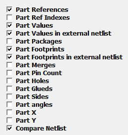
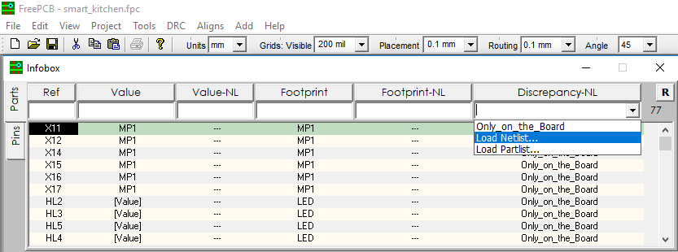
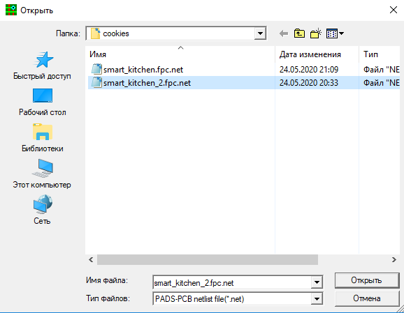
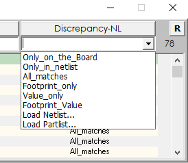
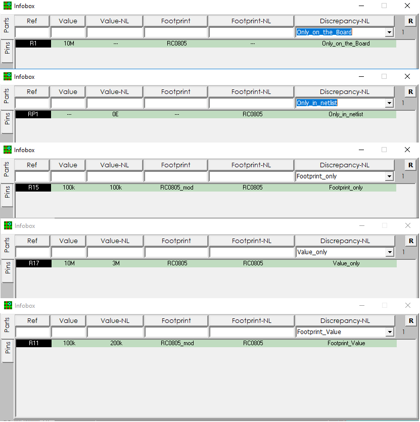

## `Comparing partlists`

If you are professionally engaged in the development of printed circuit boards, then you probably have many projects of printed circuit boards and many versions of the same project, just slightly modified from version to version. The Infobox function is very useful for you, which can show differences in the value and footprint attributes of the same part in different versions of the project. To compare them, you need to load the Netlist of the previous version of the circuit board into Infobox. It’s useful to know that in FreePcb-2 Netlist is automatically saved in the cookie folder when you simply click on the “Save Project” button. This Netlist is saved in the regular PADS-PCB format and is therefore suitable for loading into Infobox as an external netlist. So, let's begin. First, we need to make visible the Infobox columns that we will need to compare - these are value and value-NL, as well as footprint and footprint-NL. Enter the InfoBox setting dialog via the right-click menu, and check the checkbox on value, value-NL, footprint, footprint-NL, Compare Netlist, and then close the settings window.

Now download the netlist file from the previous version of this project. From the Discrepancy-NL column drop-down list, select LOAD NETLIST and select a file with the * .net extension.

In the EXAMPLE folder that you downloaded there is a cookies folder, it has a netlist file called smart_kitchen_2. This project has been slightly modified from the original (smart_kitchen). Let's find the differences.

First of all, look at what exactly is in the drop-down list of the search window (in the CNetlist column). If the files are identical in the value and footprint attributes, then the list will contain only the string "All_matches". In addition to the All_matches menu item, we have other items:

Choosing each menu item in turn, you can see all the differences between the versions of projects. To jump on a part, double-click on the part in the RefDes column.

