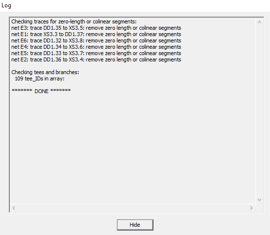

When you edit traces, colinear segments may appear that remain invisible visually, they do not make any sense, but only clutter up the project file. Such segments can be formed, for example, as a result of using the alignment function of the vertices of trace segments. Therefore, it is useful to check from time to time for the presence of such segments. When no objects are selected, press `F7 (CHECK_TRACES)` and the extra vertices of the segments will be deleted, and the result will be displayed in the Log. 

P.S. Due to such vertex segments, the Set Clearance function may not work correctly to set the clearance of parallel segments, which does not move colinear segments.

# [return](How_to.md)
