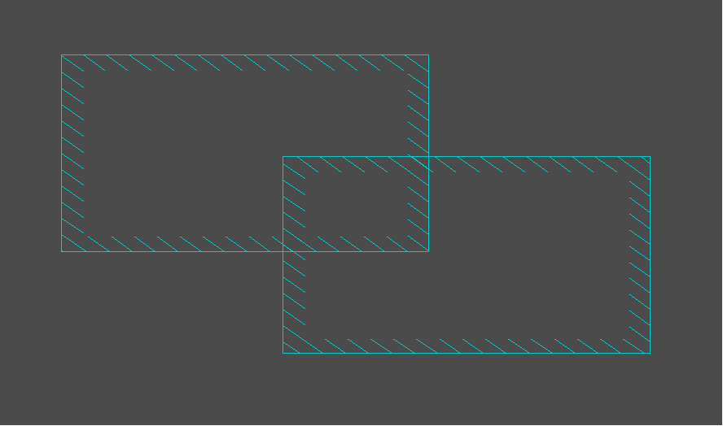
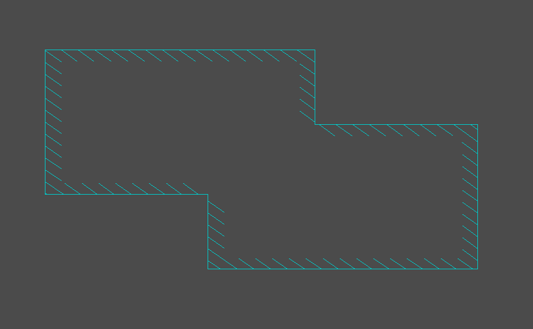

### Combine areas

You can combine intersecting similar copper areas. Unlike FreePcb-1.359, which combined any intersecting areas, in FreePcb-2 areas must have the same hatch pattern and same side width. 

Select the DRC->Check Copper Areas main menu item and such areas will be merged.

