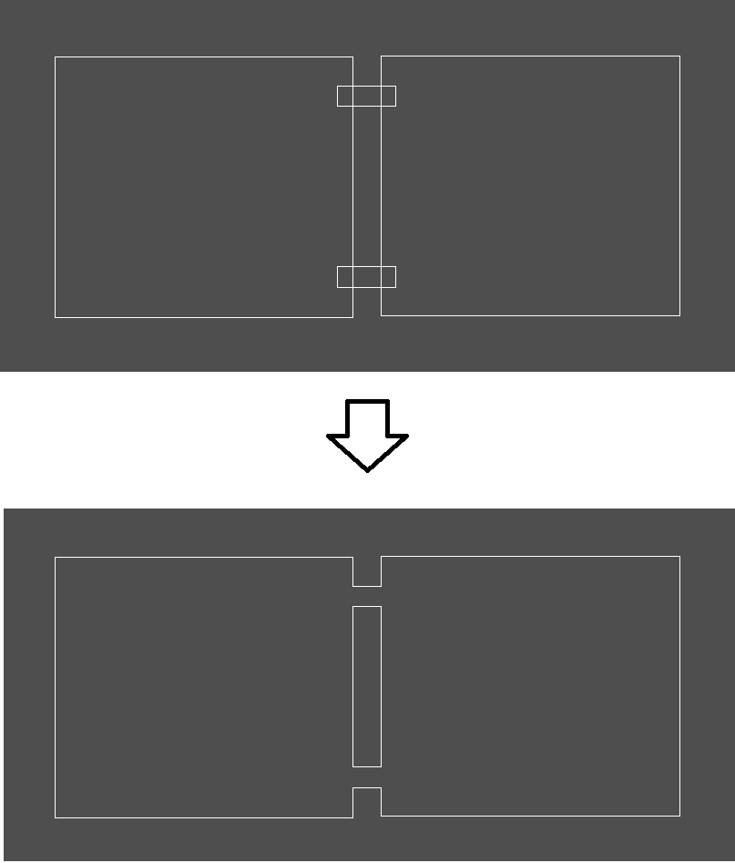
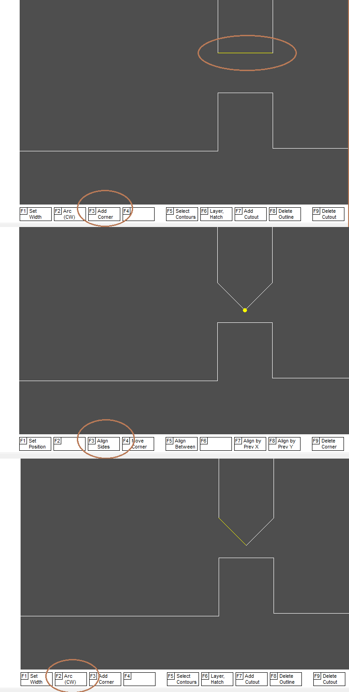
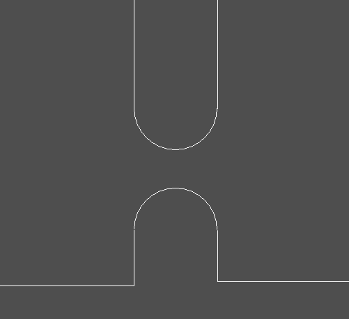

**Combine Intersecting Polylines**

A PCB outline line or other polyline can be combined with a similar intersecting line. Before proceeding, you need to make sure that the line is closed, the thickness, layer, and hatching style are the same for both polylines. Next, select the main menu function `Project -> Combine Intersecting Polylines`

You can use this option when creating a panel of several printed circuit boards. The boards need to be placed at some distance from each other, and then add closed polylines in the board_outline layer, in those places where you want to connect them.

Then click the Combine_Board_Outlines button in the Tools menu and get something like this:

Then, by adding extra vertices, you can round sharp corners, because at the factory, the cutter (which cuts the board along the contour) will not be able to fulfill the internal corners. Usually it has a diameter of 2-3mm.

If the board at the factory will be cut with a laser, then you can send it to them without rounding.
