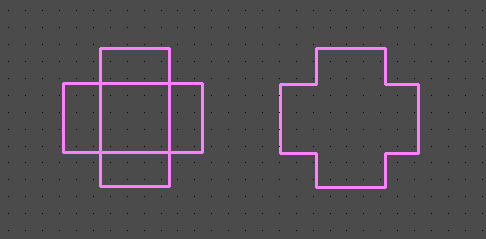

### Combine Intersecting Polylines

A PCB outline line or other polyline can be combined with a similar intersecting line. Before proceeding, you need to make sure that the line is closed, the thickness, layer, and hatching style are the same for both polylines. Next, select the main menu function `Project -> Combine Intersecting Polylines`

