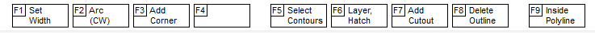

### Polylines

When the line is already drawn, you can edit its thickness, the hatching pattern as well as the layer. For the menu to appear, select the side of the line.

* F1 - Setting the line width, as well as the choice: area or line (closed or open)
* F2 - segment shape: straight or arc
* F5 - Select contour. If you want to copy a line, you must use this function before copying, and then copy (ctrl + c ctrl + v)
* F6 - Change the layer and hatching pattern if the line is closed (region)
* F9 - selection of all elements located inside the polyline contour. It is useful when you have for example a panel of printed circuit boards, and you need to select a printed circuit board among many printed circuit boards that have a complex shape of the contour line.
