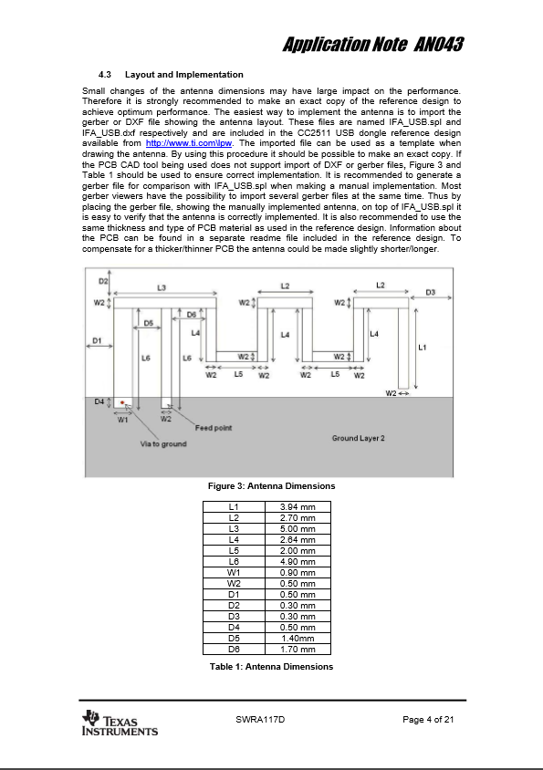
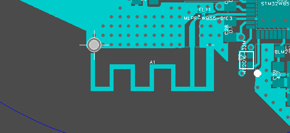

# How to edit polyline?

When the polyline node is selected, a menu appears where you can:

* `F1 (SET_POSITION)` - set the position of this vertex in coordinates.
* `F2 (SELECT_ALL)` - select the entire polyline. After clicking, all vertices of this polyline will be selected, and the button bar will change to edit a group of objects.
* `F3 (ALIGN_SIDES)` - align the sides at an angle of 45 or 90 degrees
* `F4 (MOVE)` - enter the drag mode of the polyline node.
* `F5 (SET_ORIGIN)` - set the origin to this place.
* `F6 (DELETE)` - delete the vertex.
* `F7` `F8` - align on `X` or `Y` coordinates of another line or pad. Click on the node of another line or on the pad, and then click on the node that you want to align. And now press F7 or F8 depending on the axis of alignment.

When the polyline node is selected, a menu appears where you can:

* `F1 (SET_WIDTH)` - set the width of this polyline, as well as a choice: fill polygon or polyline.
* `F2 (STRAIGHT/ARC_CW/ARC_CCW)` - if the side is not vertical and not horizontal, then you can make an elliptical arc (1/4 ellipse) from a straight line.
* `F3 (ADD_CORNER)` - if the line is straight, then this button is active. Click to insert an additional vertex into this segment of the polyline.
* `F4 (HATCH)` - if the line is closed (see F1), then this button is active. Click to fill or clear the area inside the polyline outline.
* `F5 (HIDE)` - you can hide the line. In this case, it will not be displayed in the PCB editor of the printed circuit board, and it will not be in gerber files.
* `F6` - transfer the polyline to the copper layer for example to draw an antenna. Complex shapes can be drawn with a closed polyline.

You can create a part consisting of several. To do this, select the Import Footprint menu item and import other footprints into the current footprint.

* `F8` -  also you can move the polyline to the notes layer.

[return](How_to.md)
