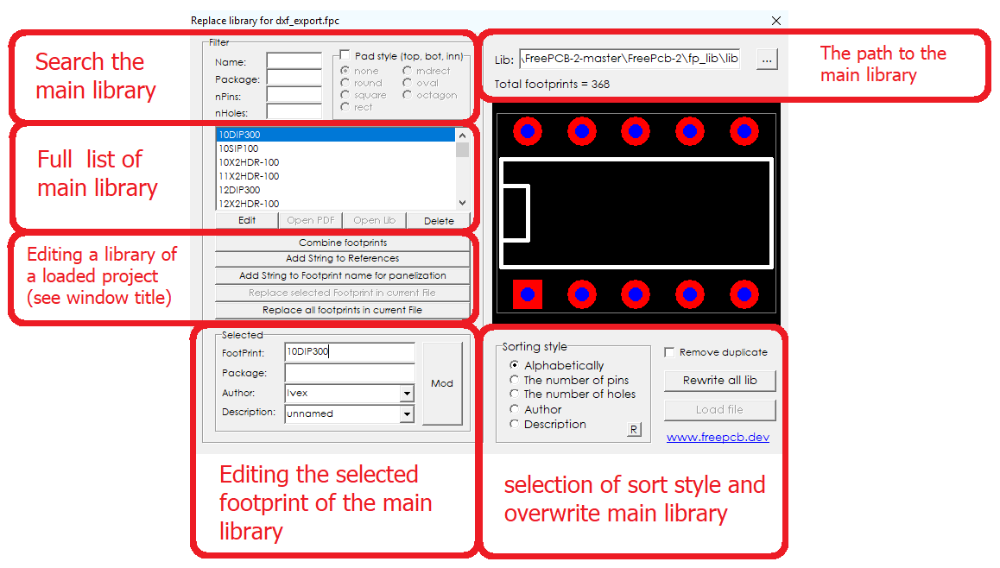
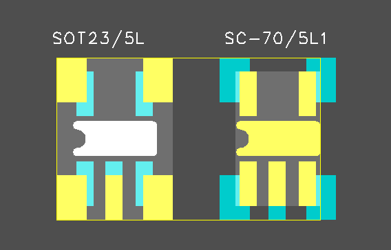
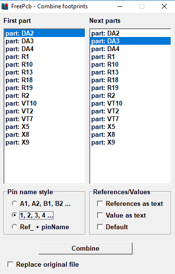
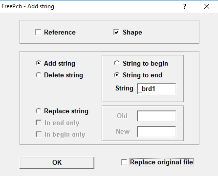

## `Sort footprints in libraries`

Using the Edit_Libraries application, you can sort footprints and move between libraries. For example, you can sort in alphabetical order. This means that all footprints whose name begins with the letter A will be moved to the A.fpl library. This will be done for all letters of the alphabet.
Here is a complete list of sorting styles:

* alphabetically
* by the number of pins
* by the number of holes
* by name of author
* by description

Launch the application from the Infobox right-click menu.
The main program window will open

To start sorting select a style, click the Rewrite all lib button.

## `Application Features`

1) You can combine two or more footprints into one. It is convenient to use when you need to make a universal footprint for different types of cases. For example, for `SOT-23-5` and `SC-70-5`.

Place these parts on a printed circuit board one on top of the other or next to each other, save the project, and only after saving, run the Edit_Libraries application. Now click the `Combine footprints` button, a new window will open in which you must specify the main footprint (left) and child footprints (right). Next, select the pin name style and then click OK.

Now two parts have turned into one and it will be more convenient to drag it.

2) When you assemble a panel from several projects, it is recommended to use this option in order to avoid footprint library errors. This error may occur if you edited the footprints in the project and the local libraries are now different from each other. In order for paneling to complete successfully, you need to add a suffix to the names of the footprints, for example, this: `__brd1`. In another project, you add for example `__brd2`, etc. In the last project, you may not add. 

Press the button:

A new window will open in which you must enter a suffix or prefix.

After that, you can safely insert one project into another and there will be no library conflict. To import another project to current, select the menu `Edit` -> `Paste Group from file`

3) Update the entire local footprint library. Footprint elements will be downloaded from the main library and saved to a file. The program will search for footprints by name and replace if the number of pins in the footprints matches.

Press the button:

