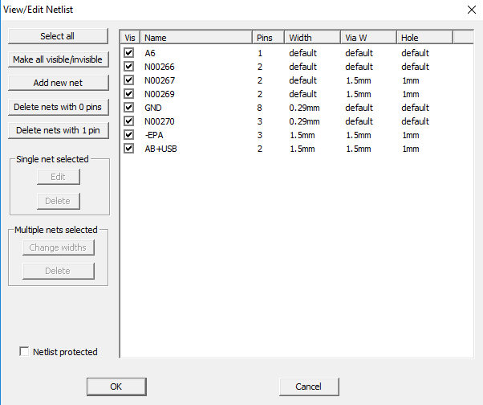
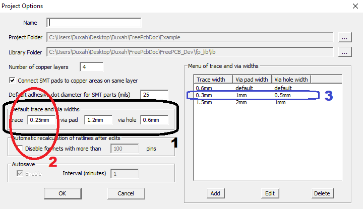

### Nets

To start editing trace widths and vias for nets, go to Project->Nets in the main menu. A dialog box will open. As can be seen from the screenshot, we will consider four options for setting parameters for nets. In the first two lines we see that both the width of the traces and the size of vias are set by default. In this case, FreePcb-2 takes the value of the width of the trace and the size of the vias from the Project->Options dialog box for the default values (see. Fig.)

In the second case, we see that the width of the track is set by default, but the size of the vias is rigidly set to 1.5/1mm.
In the third case, the width of the path is 0.3mm, and the size of the vias is not set, so FreePcb-2 will take the vias for the traces 0.3mm from the Options dialog box, i.e. 1/0.5mm (if there is no 0.3mm in the Options window, then the size of the vias will be set as in case No. 1)

[return](How_to.md)
