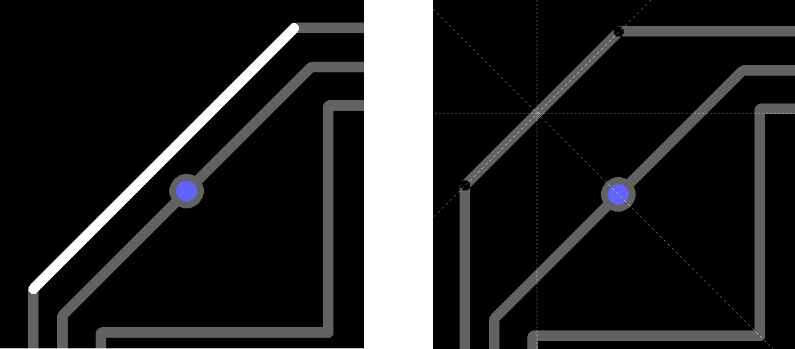
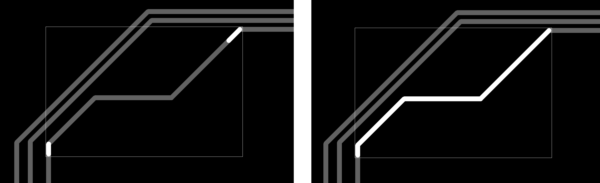

## 1) You can add a vertex to the copper route segment. 

When the segment is highlighted, click `F3_Add_Vertex`, and an extra vertex will be added. Left click in the place where you want to place it.

## 2) You can move the track segment. 

When the segment is highlighted, press `F4_Move_Segment`, or use the keyboard arrows. This function works provided that the vertices of the segment are not the nodes of the connection of three or more segments of the tracks.

## 3) You can move the vertex of the trace. 

When the vertex is highlighted, press `F4_Move_Vertex`, or use the keyboard arrows.

## 4) You can change the width...

...of a segment and / or the size of the via. When the segment is highlighted, click `F1_Set_Width` button.

## 5) You can change the segment layer.

When a segment is highlighted, press F2_Change_Layer.

## 6) You can select a group...

...of contiguous segments that are in the same layer with the selected segment in order to then change their width, for example. When the segment is highlighted, press `F7_Select_in_Layer`.

## 7) You can select...

...all the segments of the trace that are between the two selected segments. Highlight the two segments by holding down the CONTROL button, and then press `F6_Select_Between`.

But if two parallel segments were selected, then first the function will look for parallel segments between selected segments.

Press `F6` again to get the result.

## 8) You can smooth the corner by adding another segment.

When the vertex is selected, press `F5_Insert_Vertex` to start dragging the new segment. 

It is useful to know that if at this moment you click the right mouse button, then the length of the new segment will be equal to the length of the previous segment. This option is good when you need to insert several times in a row.

## 9) You can change the corner portion... 

...of the route formed by two adjacent segments, adding two more segments by pressing just one button. Sometimes useful when editing. When the first vertex is selected, move the mouse to where you want to place the new vertex, 

and then click `F6_Insert_Vertices`. That's what happened:

After that, the next nearby vertex will be automatically selected to speed up editing.

## 10) You can align vertex...

...of the trace segment along X or Y coordinates. 

Click on another vertex or pad whose coordinates you want to memorize, and then click on the vertex you want to align with these coordinates. Press the `F7` or `F8` button depending on the alignment axis (X or Y).

## 11) You can convert a segment to an arc and back. 

When a segment is selected, right-click and, in the context menu, click Arc approximation. To convert back press `F7_Delete_Group`. To delete the entire bridge, press `F9_Delete_Bridge`

## 12) You can change the radius of the arc. 

When a group of segments is highlighted, press `F2` to decrease or `F3` to increase the radius.

## 13) You can create a branch to pin. 

When the vertex is highlighted, click `F2_Connect_Pin` to start dragging. Aim at the desired pin, and complete the action by clicking the left mouse button.

# [Return](How_to.md)
