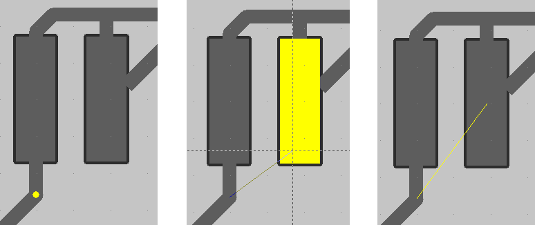

## You can create a branch to pin. 

When the vertex is highlighted, click `F2_Connect_Pin` to start dragging. Aim at the desired pin, and complete the action by clicking the left mouse button.

# [Return](How_to.md)
