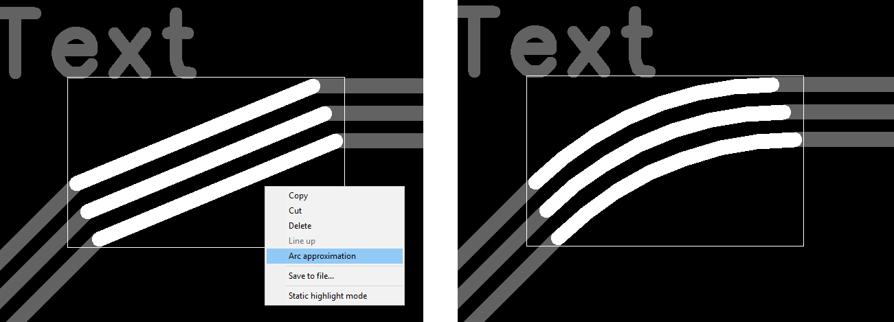
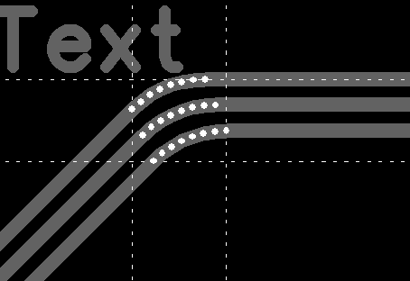
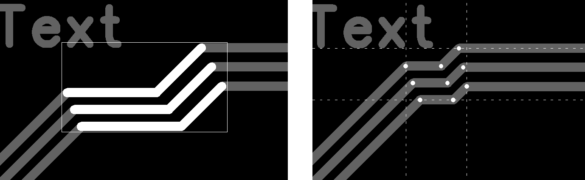

## 10) You can set the clearance between parallel segments. 
The initial clearance value will be taken from the DRC dialog box (trace to trace). Select two parallel segments, between which there are other segments of other trace (_Note: If you want the bottom segment to remain in place, then select the top one and then the bottom_):

Press the `F6_Select_between` button

Press the `F4_Set_Clearance` button

The clearance value is shown in the status bar at the bottom of the program window. You can then change the clearance by pressing the `F2` `F3` buttons. The modified clearance value will be stored in memory until you press the save button at the top left.

## 11) You can align vertex...

...of the trace segment along X or Y coordinates. 

Click on another vertex or pad whose coordinates you want to memorize, and then click on the vertex you want to align with these coordinates. Press the `F7` or `F8` button depending on the alignment axis (X or Y).

## 12) You can convert a segment to an arc and back. 

When a segment is selected, right-click and, in the context menu, click Arc approximation. 

To convert back press `F7_Delete_Group`. To delete the entire bridge, press `F9_Delete_Bridge`

## 13) You can change the radius of the arc. 

When a group of segments is highlighted, press `F2` to decrease or `F3` to increase the radius.

## 14) You can create a branch to pin. 

When the vertex is highlighted, click `F2_Connect_Pin` to start dragging. Aim at the desired pin, and complete the action by clicking the left mouse button.

# [Return](How_to.md)
