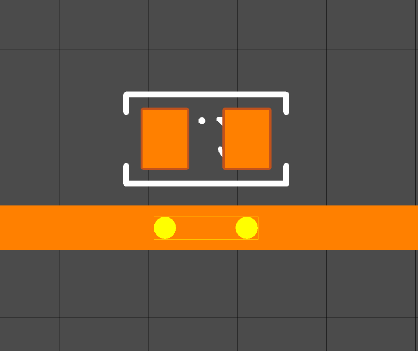
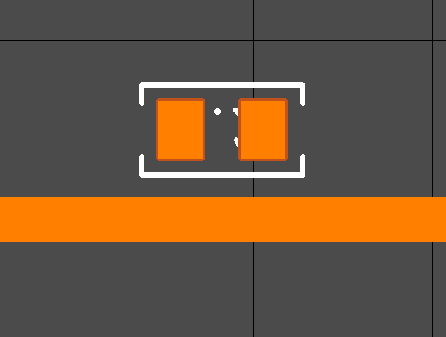
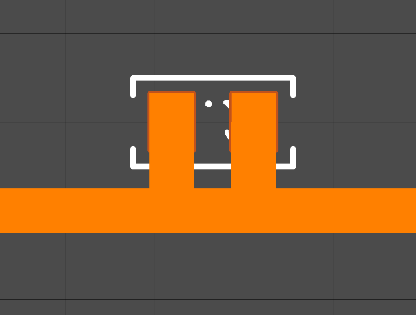

It may be necessary to insert a two-pin part in the route branch, so that, for example, then divide the network into 2 different ones.

I will show you with a simple example how to do this. 

We put the part in the place where there will be a gap, then add two [additional nodes]() to the segment of the route. 

[Connect]() these nodes to the pins. Now delete the extra segment by pressing the F9 button.

Now you can [divide]() the net into 2 different.

# [Return](How_to.md)
