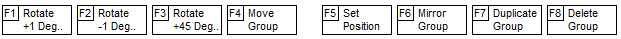

When several objects are selected at once, you can:

- `F1` `F2` `F3` - rotate objects by an integer angle.
- `F4` - Move Group
- `F5` - shift the position by a given value along the X and Y axis.
- `F6` - flip or flip to the other side of the circuit board.
- `F7` - Duplicate Group

# [return](How_to.md)
