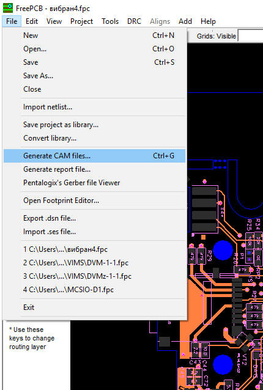
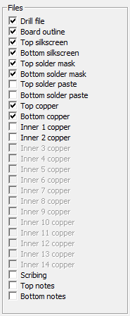
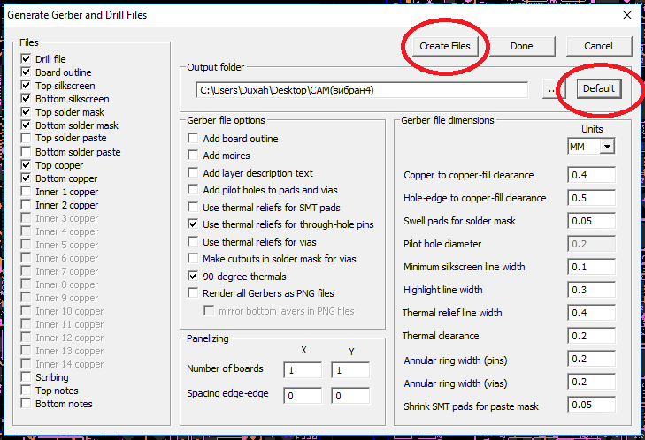
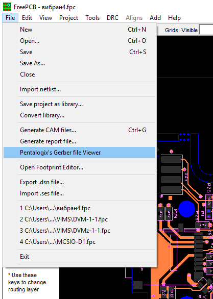

### How to export FreePCB v2.028 to gerber files

`Generate Drill and Gerber Files`

Select File -> Generate CAM files from the menu to open the gerber generation tool.
 

In general, there are 8x layers you need to have a PCB fabricated:

* Top Copper + Top Solder mask  + Top Silkscreen 
*	Bottom Copper + Bottom Solder mask + Bottom Silkscreen 
*	Board outline 
*	Drill file

In the window that opens, select the layers:
 
 
 
If there are inner layers, select them. If you don't know which layers, please check all layers, JLCPCB will help you to use the right layers. Then click the DEFAULT button, and then click the CREATE FILES button.
 
 
 
FreePcb is configured to work with ViewMate. Check out the Gerber files by clicking on the Pentalogix's Gerber file Viewer button. 
 
 
 
Or if you have another Gerber file viewer installed, then open the files manually in it. 
