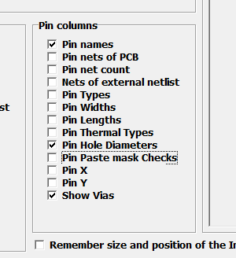
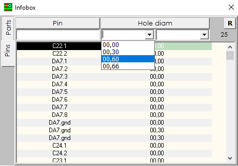

### Hole Diameters

In the Infobox settings, check the box next to Hole Diameters and be sure to check the box next to Show Vias. Now go to the PINS tab, and you can see all the diameters of the holes used.

Here you see two search boxes instead of one. In the left you need to select the minimum value of the range, and in the right the maximum. Anything that does not fall into this range will be discarded by the Infobox filter.
