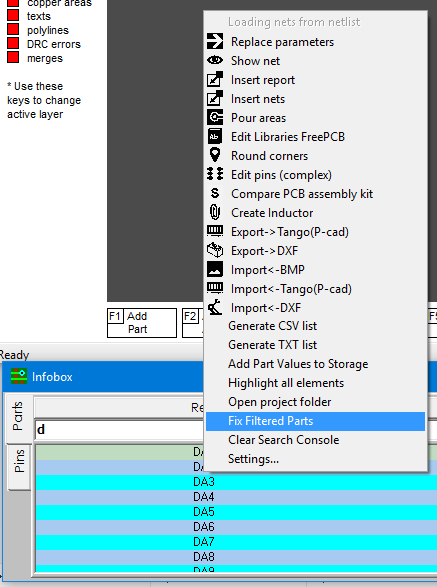

### Fix Filtered Parts

Sometimes you need to fix the list of filtered parts and free up the search console. This feature has been added to Infobox since version FreePcb 2-033. In the right-click menu, select Fix Filtered Parts. You can always determine that the list is not complete by the changed background color of the InfoBox window. To clear the search console, use the Clear search console function in the right-click menu. To completely reset the filter and return the full list, click the R button in the upper right corner of the info box.

