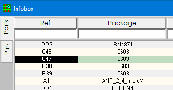
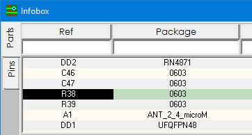
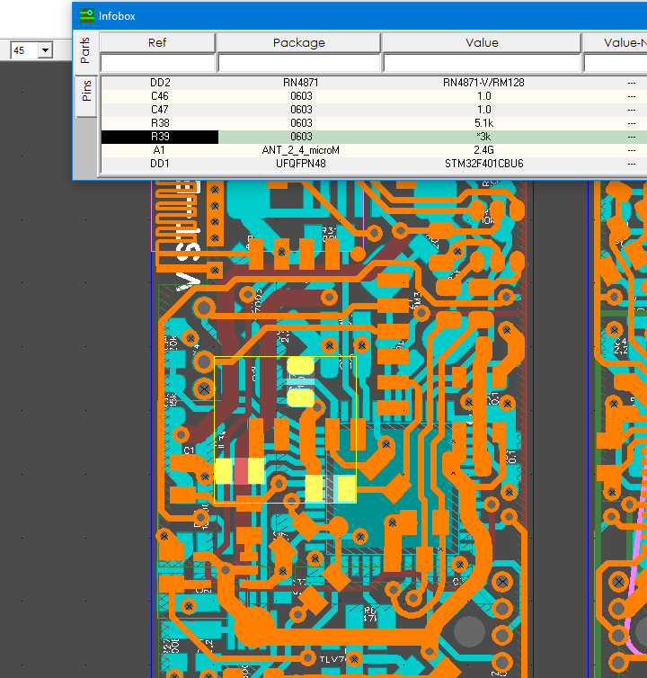
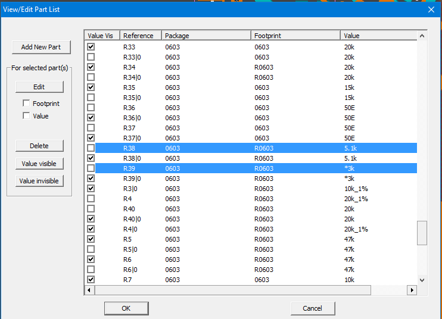
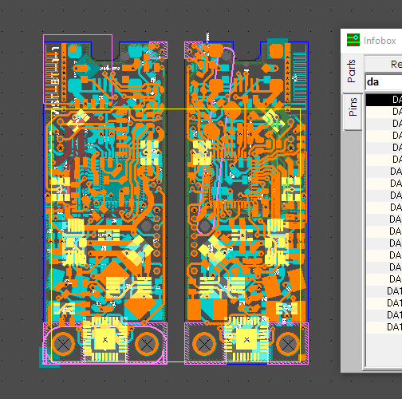
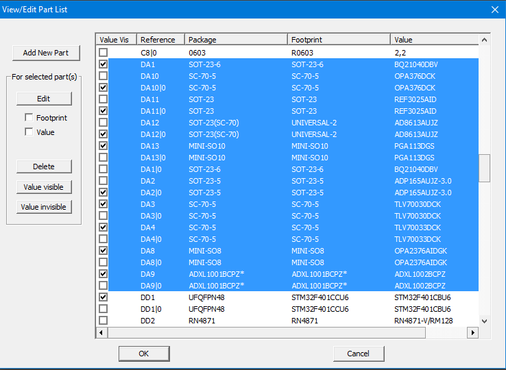

### How to highlight parts from InfoBox

Click on a part in the list and press ENTER, then click on the next and press ENTER again, etc.

When a new part is highlighted, the previous one remains highlighted. As a result, several details are highlighted. Now you can enter the Project -> Parts main menu and edit the attributes of these parts, or edit the size and thickness of the silk-screen lines by pressing the F9_EDIT_CILK key

In addition to highlighting individually, you can select the entire list at once. Right click on the list and click on the 'Highlight All' button.

It is useful to know that when the list is already highlighted, pressing 'Highlight All' again will change the highlight mode of the selected parts - the highlight will take on a crossed out form. This feature can be used when printing, when you need to print a view with highlighted details. When you create gerber files with highlighted details, in addition to the other layers, a layer is also created with the name HIGHLIGHTS.gbr which can be printed. (See How to print a printed circuit board view)

