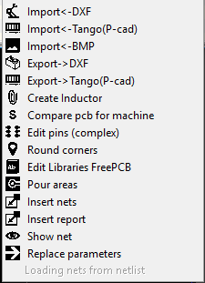

# What is Infobox for FreePCB-2?

Infobox is the main application of the entire FreePcb-2 tools.
Using Infobox you can: 

1) Launch other gadgets using the right-click menu on the Infobox info field:

2) Jump on a part or pin according to the list

3) Filter the list of parts and pins by various parameters and highlight the filtered elements on the PCB.

4) Generate BOM-file

5) Find changes between PCB project versions

and etc.

To open the menu, right-click on the infobox window (on the list)

_During operation, the infobox sends requests to the main FreePCB window and receives data from it in the form of text strings hanging in RAM. As a result of which, while working with antivirus programs, problems can sometimes arise. If your antivirus software thinks that Infobox is a virus, then you will have to add it to the exclusion list._

# [return](How_to.md)
