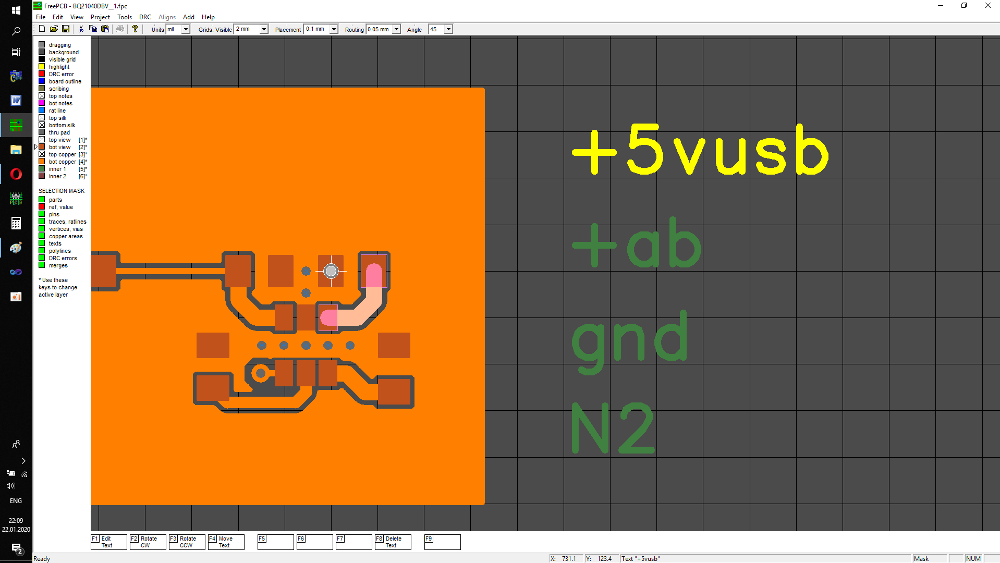

## Insert net names into PCB

You can insert net names as text in a column in a circuit board design. When you click on the text, the corresponding network will be highlighted. To get started, save the project by clicking on the floppy disk icon. Now you need to start Infobox, if it is not already running, press CTRL + F. Open the "Insert Nets" application from the menu of the right button of the Infobox, and in it we indicate the text size of the  net names, as well as the coordinate of the upper left corner of the array of text strings. For FreePcb-2 starting with version 2-033, just select the place you want to insert into: right or bottom.

This is actually the place where we want to insert this text. When you click on the text, the net will be half-highlighted. To highlight at full brightness, press N.

