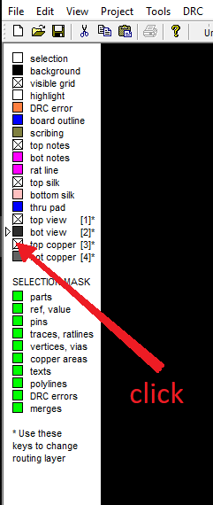
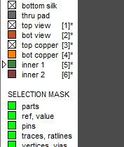

Click on the box opposite the layer in the left panel to make the layer visible / invisible.

With buttons `1` and `2` you can switch the view of the board `TOP view` and `BOTTOM view`, respectively. In this case, the visibility of the opposite layer is automatically turned off.

With buttons `3` and `4` you can change the priority display layer of the `TOP COPPER` layer and `BOTTOM COPPER` layer, respectively. If you press the button again, the corresponding layer of silk-screen printing will go to the background. Sometimes useful. 

When you click on a PCB element, then the elements of the active layer have priority. So for example, if you need to select a track in the INNER1 layer, first make INNER1 layer an active layer by pressing button `5`

If you don’t like the fact that when pressing buttons `1` or `2` some opposite layers become invisible and you do not need it, but you want to use these buttons when editing printed circuit boards, then make both layers (`Top View` & `Bottom View`) invisible, and these the buttons will work similar to the first classic version of FreePcb. The buttons `1` and `2` to switch the `TOP COPPER` layer and `BOTTOM COPPER` layer. 

[return](How_to.md)
