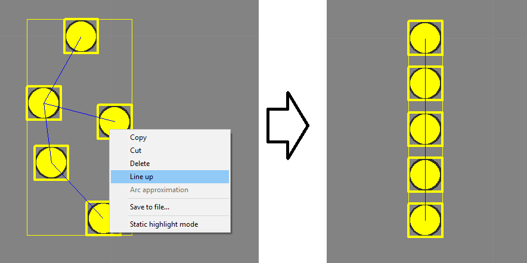
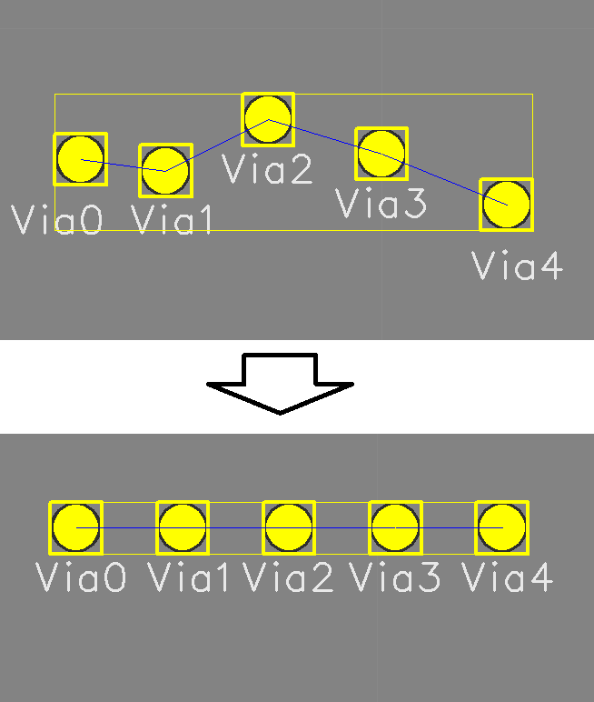
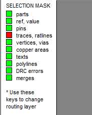

## How to align selected parts in a line?

When some parts selected, right click and push LineUp context menu item. If Y dimention of selected rectangle larger X dimention, parts to vertically line up. If X dimention larger then Y dimention, parts to horizontally line up.

If the menu item is not active then try to select parts by disabling the ratlines in selection mask.

