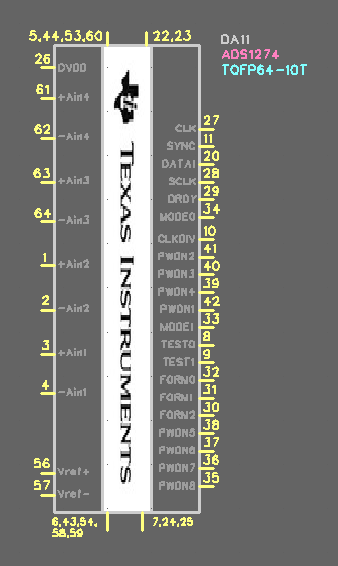
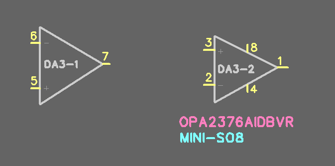
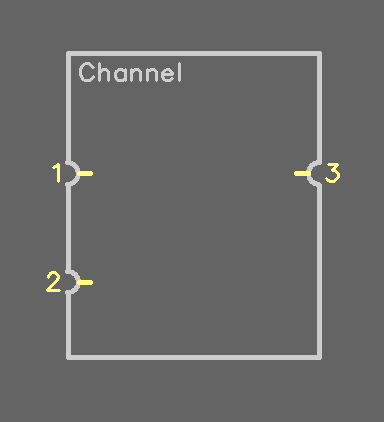
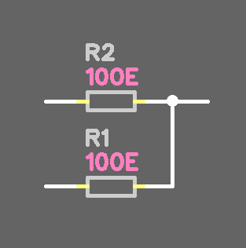
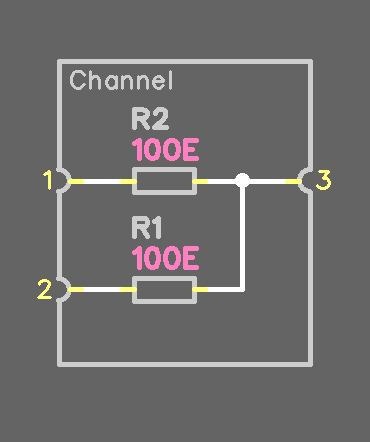
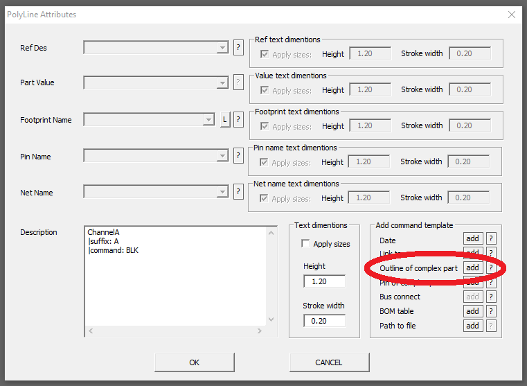
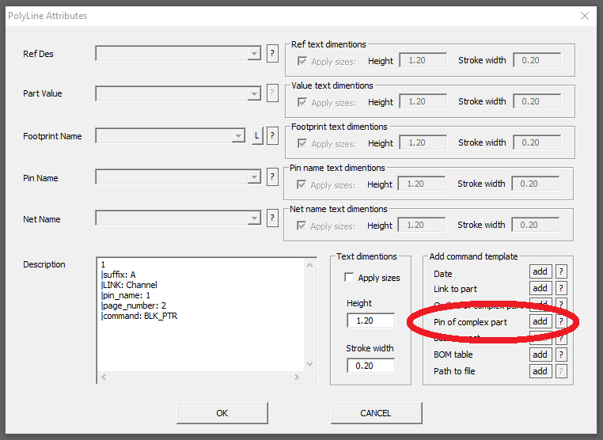
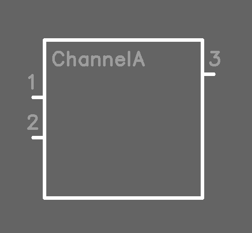

## how the parts might look in Schematic Constructor 1.1

Or Multiple part:

## How to create a complex part? (since v1.1)

Sometimes in multi-channel diagrams it is convenient to create complex parts to duplicate repeating blocks. A complex part is a small electrical diagram inside the part of the Schematic Constructor. In general terms, this is created like this: On a separate page that is not included in any netlist, draw the part with the leads inward (and not outward, as in a normal part), set the name of the part (this is the RefDes attribute), for example CHANNEL. 

Place a circuit diagram of ordinary parts inside this part and connect it to the leads of the part: CHANNEL.

On the main page where you have the electrical diagram of the project, draw a rectangle. Then, by selecting the side of this rectangle and pressing F1, in the polyline attributes dialog box, select the Outline of complex part script. 

Then, next to the contour line of the complex part, draw a pin polyline in contact with the contour polyline, and in the polyline attributes dialog box, select the Pin of complex part script and enter the appropriate parameters.

Now you're done.
