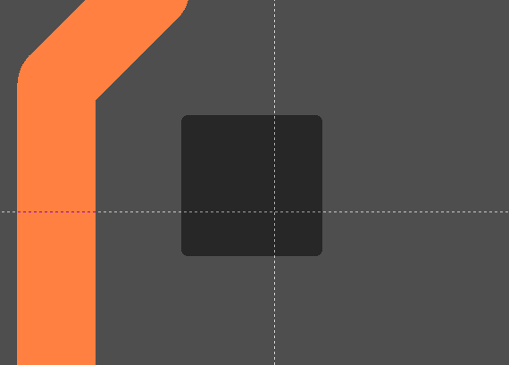
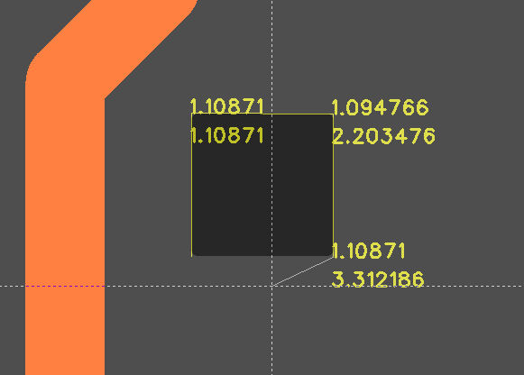
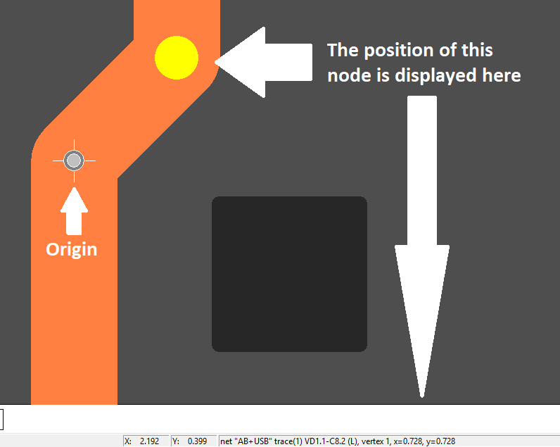
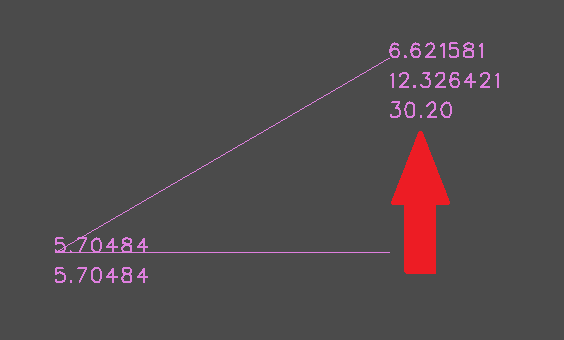

## The measurement tool

The measurement tool is switched on with the `M` button on the keyboard. The cursor will take the form:

Click on the start point of the measurement, then click on the end point. The result will be displayed at the bottom of the status bar, as well as on the screen in the form of static highlighting near the end point. The first value is equivalent to the distance from the previous vertex, the second is the distance from the first point (the length of the broken line). Thus it is possible to measure for example the perimeter of a polygon.

To cancel highlighting, right-click `CANCEL_HIGHLIGHT` in the mode when nothing is selected. You can also measure the distance between two objects by setting the origin in the first object, and then by moving the mouse cursor to the final object you can observe the distance in the status line. In order to move the origin to an object, select the object (pad, track or area node) and in the `TOOLS` main menu press Set_origin_to_selected_item

Starting from version 2.032, the angle between two lines is also displayed during measurement:

