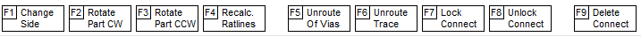

## Start dragging part

With part or pin selected, press `F4_MOVE_PART` to begin moving it. When a part is merged with other parts, it is better to move it by selecting a pin.
 

 
`In drag mode, you can:`

* F1- change side parts,
* F2- rotate -90 degrees,
* F3- rotate +90 degrees,
* F4- recalculate ratlines,
* F5- unroute all segments of pins to the vias,
* F6- unroute all traces pins of this part,
* F7- lock all pin connections of this part,
* F8- unlock all the pin connections for this part,
* F9- remove all pin connections of this part in order to reroute

