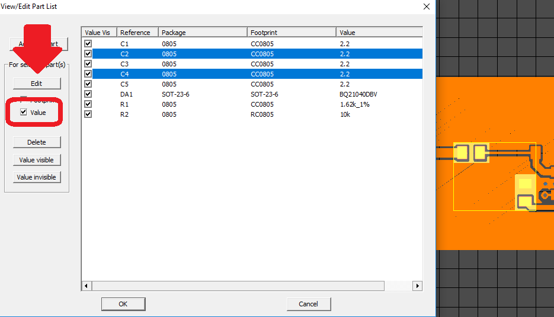

### Partlist

Sometimes it becomes necessary to select the same value of a parameter (for example, VALUE) for several parts. Select the parts on the PCB with the CTRL key pressed and go to the Project -> Parts menu. Highlighted parts on the board will also be highlighted in the list. Select the parameter you want to edit (VALUE or FOOTPRINT) in the left field. If you are editing a footprint, you need to select it in the library directory tree.

If the new footprint is already used in other parts on this printed circuit board, then it is stored in the local cache, in which case it will be enough to simply enter the name in the footprint edit box. Enter a new value and click OK.
 

 
[return](How_to.md)
