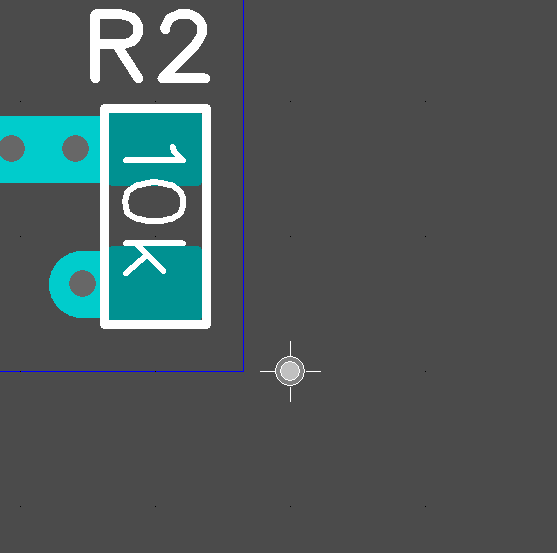
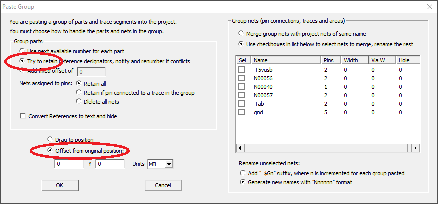
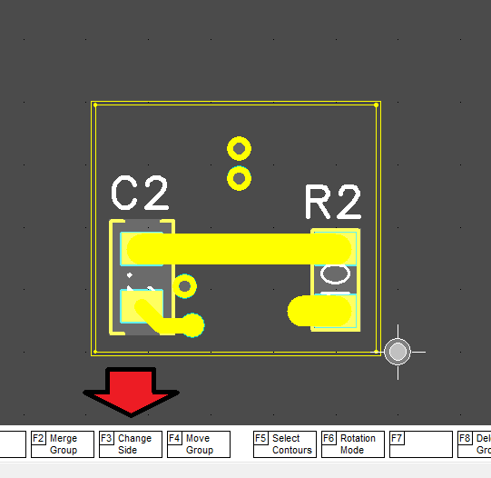
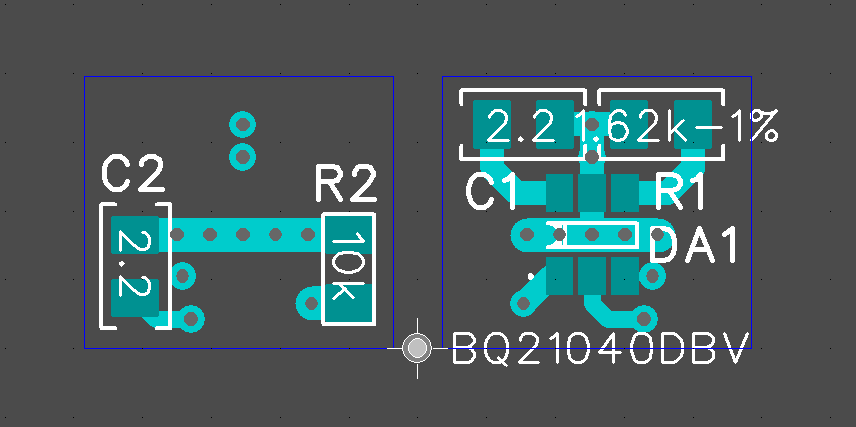

You can pretend the back of the circuit board next to the main board to print.

Using the TOOLS -> MOVE ORIGIN main menu function, position the origin to the right of the border line at a distance of about 1 mm.

* Press in the main menu EDIT -> SELECT ALL
* Press CTRL + C or in the main menu EDIT -> COPY
* Press CTRL + V or in the main menu EDIT -> PASTE

In the dialog box, you need to select "Try to retain reference designators" as well as "Offset from original position". 

Then click OK and it is very important not to remove the selection to immediately reflect the elements of the printed circuit board by pressing the F3 (Change Side) button.

Now you need to create gerber files for the layers you want to print. Press CTRL G and in the dialog box select the layers, as well as the folder for printing. Press the DEFAULT button several times to select a name. I usually lean toward the name PRINT ...

Now the folder has appeared in the menu.

If the folder does not appear, put a shortcut on the Gerber file viewer in the ShortCut directory, which is located in the root directory with FreePcb. The Gerber File Viewer must support the drag & drop function for folders, for example ViewMate or GerberLogix.

# [Return](How_to.md)
