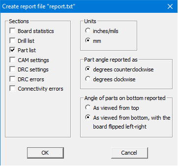
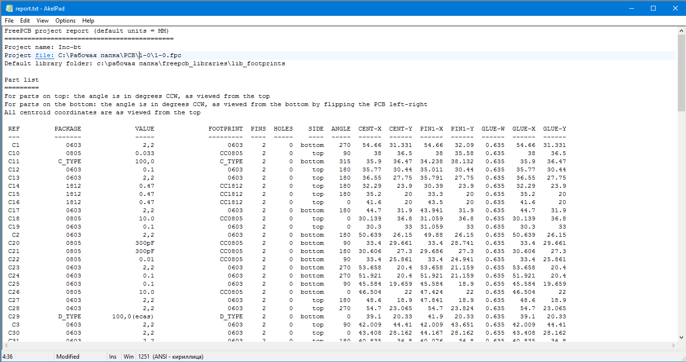

## How to generate pnp file?

Press `SELECT_ALL` in the `EDIT` menu 

_(you can also filter the necessary parts (or remove unnecessary parts) using the INFOBOX application filter, then select them on the circuit board by right-clicking the INFOBOX window partlist and selecting the context menu item HIGHLIGHT_ALL.)_, 

then click `GENERATE_REPORT_FILE` in the `FILE` menu.

In the dialog box, tick `PARTLIST`, and select the units of measurement on the right.

The file will be generated in the project folder.

# [Return](How_to.md)
