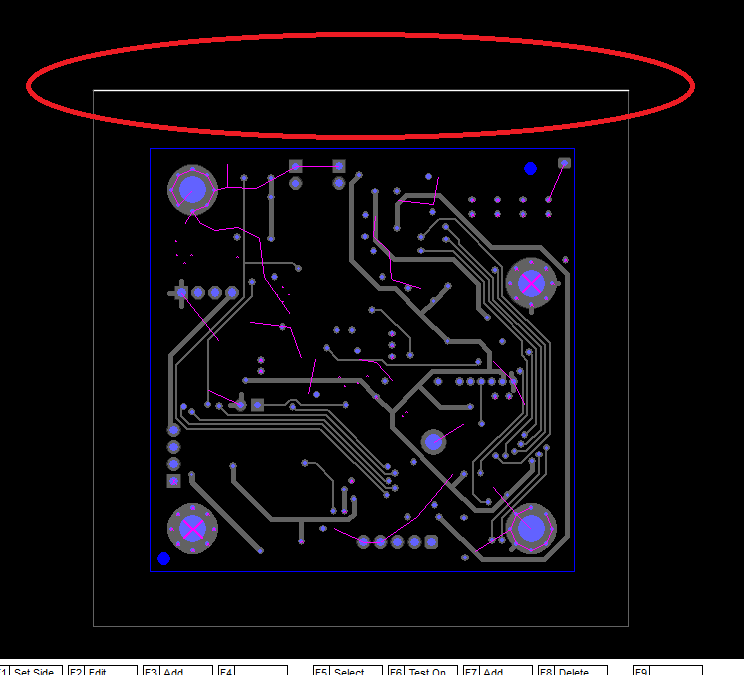
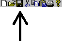
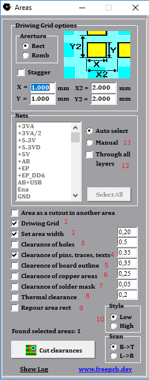
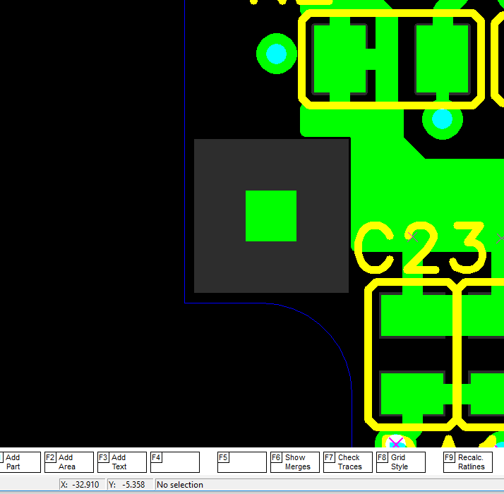
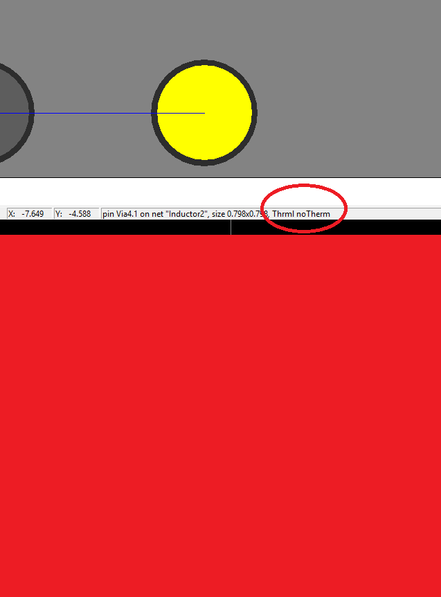
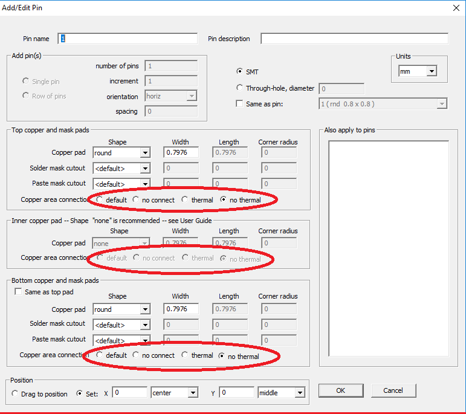
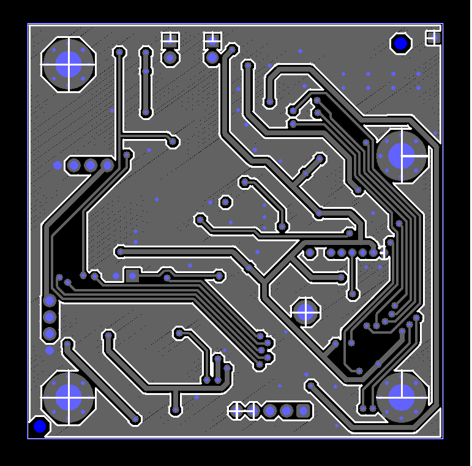

# How to pour area

Select area side

and save the file by clicking on the diskette

** part of the text is missing **

A window for settings will appear.

Here you can use the following fill options:

1) Add cutouts grid (Cutouts will be added to spaces where there are no objects.)
2) Select the width of area side  (you can specify the minimum width of the area portion)
3) Clearance for all holes
3) Clearance for pins, traces, texts on different net
4) Clearance for board outline (You can create an area around board_outline and select this option. You will end up with a fill inside board_outline.)
5) Clearance for copper areas on different net
6) Clearance for solder mask of pads on different net (You can use when you need to free up space around the pad, for example when using a label for a PCB machine:

7) Ground clearance for thermal pad. (Usually, a thermo-pad needs less clearance than on different nets).
A thermal barrier will be created for pads with the connection type to the `DEFAULT` or` THERMAL_PAD` area. To find out what type of connection has a SMD-pin, just hover over it. The type will be displayed in the status bar at the bottom of the program window. 

To see connection area type for through pin and/or change it, you need to open the part in the footprint editor. When the part is highlighted, press `F2_EDIT_FOOTPRINT`. Then, in the footprint editor, highlight the pad and press `F1_EDIT_PAD`. In the dialog box, select the connection type:

8) You can re-fill the rectangle area. (In this case, you need to delete the outdated area after the fill.
9) Cut style. When LOW is selected, the round pad is drawn as octagon, and when HIGH is selected, then as a polygon with 20 vertices

For example, with these settings, here's what happened:

# [return](How_to.md)

[How to add area](add_area.md)
