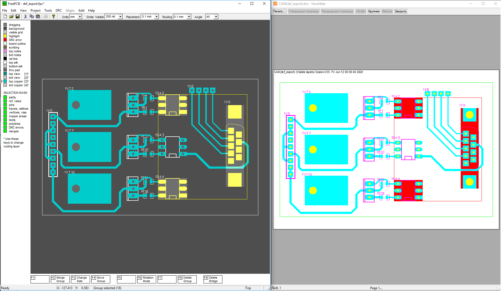

### `Printing Highlighted Objects`

FreePcb uses gerber layers for printing. If you select circuit board objects before creating gerber files and then generate gerber files, the layer `highlight.gbr` will be added to the main layer files. After loading the files into the viewer, the highlight layer will need to be placed in the foreground. Thus, the selected objects will be displayed when printing.

