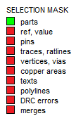
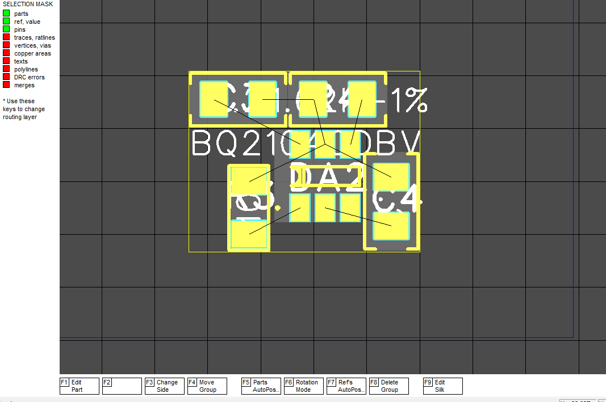
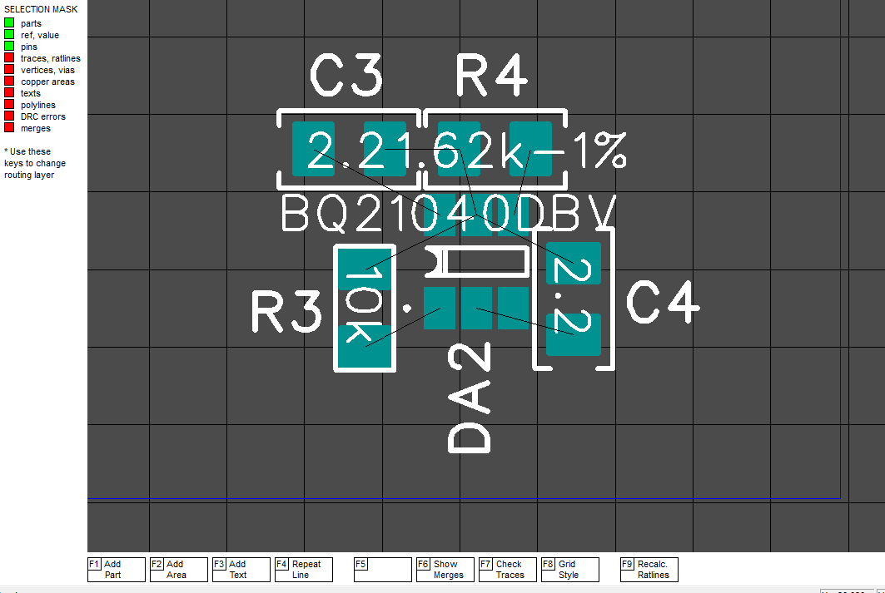

### References

Make the selection mask as shown in the figure by clicking on the PARTS string while holding down the CTRL key.

Then select a few details with the selection frame (about 10, I don’t advise highlighting a lot, since the process can take a lot of time)

Now press the F7 button (Ref_Auto_Pos). If the angle of the Ref string is not a multiple of 90 degrees, or if the program could not find the position, then after the procedure the part will remain highlighted, and the softkey menu will take a second page. Now you can press F5 (Ref Size) to reduce the Ref-size, and try again.

[Return](How_To.md)
