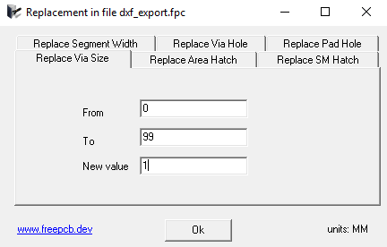

### `Parameter Replacement`

In FreePcb-2, you can quickly replace the following parameters in an entire project:

* Via size
* Via hole
* Pad hole
* Segment width
* Area hatch pattern
* sm cutout hatch pattern

The principle of the tool is that you indicate the range of values ​​of a parameter to be replaced and also indicate the new value of this parameter
This is done using an external Replace application. It is part of the Infobox and is launched from the Infobox right-click menu.

For example, if you want to make all the vias 1 mm in size in the whole project, then, choosing the appropriate tab in the window, enter the following:

FROM  `0`
TO    `99`
New value `1`
