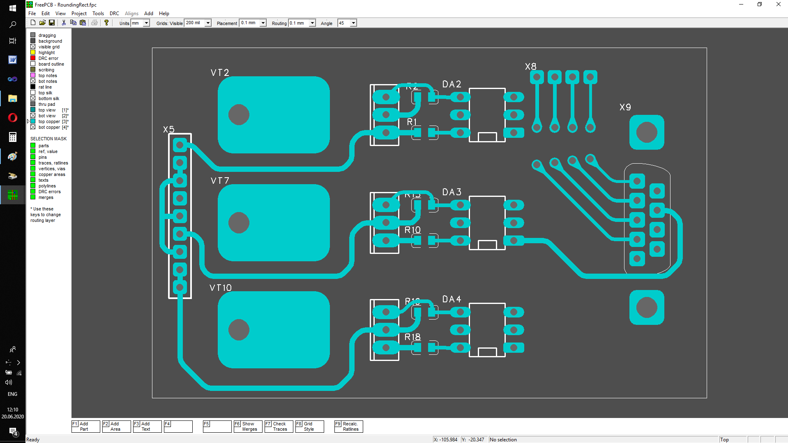
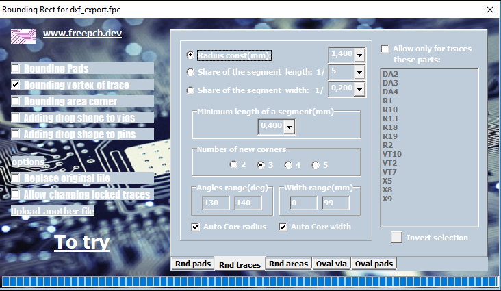
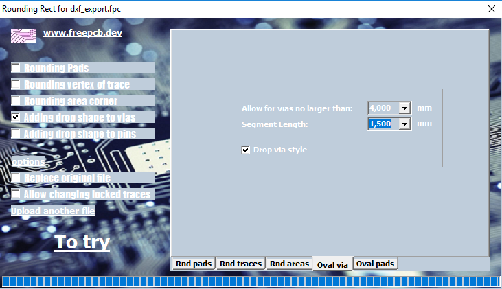

## `"Round corners" menu item`

Infobox has an application for rounding sharp corners, which can round the corners of tracks, copper areas, turn rectangular pads into rounded ones, and also make vias of an oval shape. The application reads the project file and creates a new one in the directory with the executable file, or overwrites the existing file if you select the "Replace original file" checkbox. This tool is conveniently used for global adjustment of the project file immediately before the production of the printed circuit board.
Here is a screenshot of the project window before and after processing

## `Copper traces rounding..`

First check the "Rounding vertex of traces" box on the left. Then go to the RndTraces tab and set the rnd options. For sample, you can set as in the screenshot.

Then click the "ToTry" button. A modified file opens with the options applied. Now you should do a design rule check in this file. If there are gaps errors, then you can either set a smaller initial rounding radius, or adjust the original project. In any case, close the window of the modified project so that it does not interfere. After making the changes, click the "ToTry" button again, and do the same until the design check is completed with errors. When the design check is completed without errors, you can already select the "Replace original file" checkbox, and generate it by clicking "ToTry" again.

## `Oval vias..`

First check the "Adding Drop Shape to vias" box on the left. Then go to the RndTraces tab and set the via-options. For sample, you can set as in the screenshot. 

To successfully complete this option, it is necessary to check if there are any additional nodes on the copper route near the vias. The distance from the vias to the nearest node of the same path should be greater than the specified fillet length. If at the same time you also use the option rounding traces, then this distance should be 2 times more. It is better to use these options individually.
