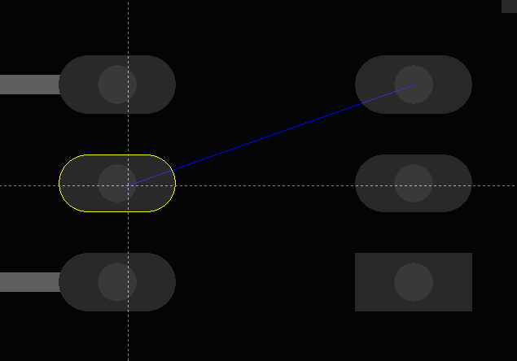
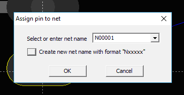
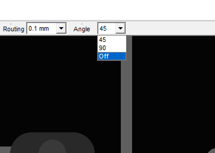

## How to draw a copper track from pin to pin?

Hit a pin, and click `F2_Connect_To_Pin`, that to start dragging connection. 
   

Click on the box to the left, or enter net name manually.

Select segment, then click `F4_Route`. Using the `F1` and `F2` buttons you can change the width of the track on the go. The values of the widths used must be specified in the project options. `F3` As_Pad button sets the width equal to the width of the pad. When you press F3 again, the pad width is increased by the default clearance of the solder mask.For routing сompletion click F4_Complete button again.

The last vertex will be highlighted. Press `F3` to align the segments under 45 degrees. You can reduce angle for alignment by changing edit box “Angle”.

The minimum value 7,5 degrees will be set, if you select OFF.

