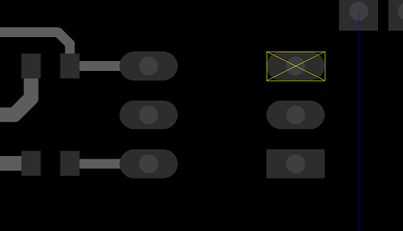
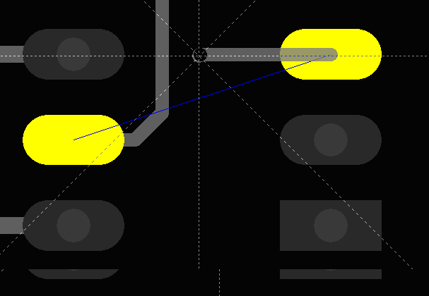
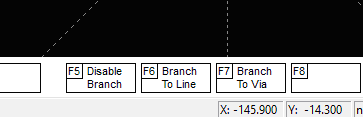
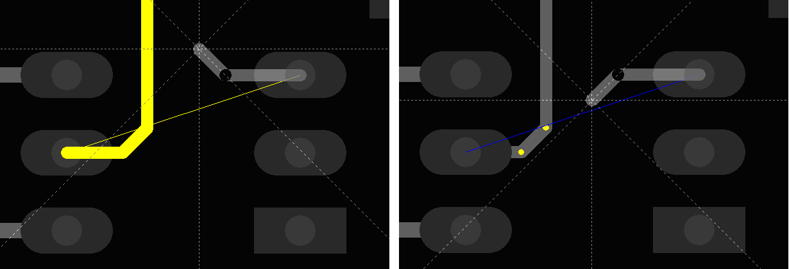

### How to route trace?(branch)
 

Hit a pin, and click F3 Start_Stub.
 

 
The following softkeys become available.
 

 
This is three routing mode. When F5_Disable_Branch mode is selected, it is not possible to create a branch to another trace, but trace to another pin can be created. F6 button allows connection to a segment of another trace. F7 button allows connection to a vertex or a via of another trace.

          

